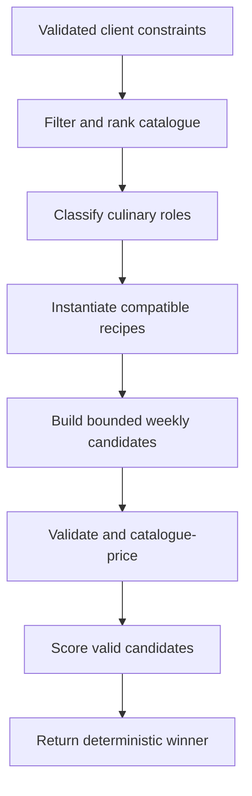

# ThriftChef Engine-Only Meal Planner — Full Implementation Specification

**Status:** Proposed implementation package  
**Repository:** `kofiarhin/thriftchef`  
**Inspected branch:** `feat/nvidia-meal-planning-ux`  
**Prepared:** 19 August 2026  
**Execution state:** Specification only; no repository changes are authorized by this document

## 1. Executive decision

Replace NVIDIA/LLM meal-plan generation with a deterministic, bounded TypeScript planning engine. The engine will filter Aldi catalogue products using the client's constraints, classify products into culinary roles, construct compatible recipes from curated templates, generate a limited number of weekly candidates, validate and price every candidate with the existing validator, score valid candidates, and return the highest-scoring plan.

The LLM must not sit in the request path, validate plans, score plans, retry plans, or be required at runtime. This removes the two-minute network dependency, API-key requirement, retry loop, non-determinism, and the risk of syntactically valid but impractical recipes.

The existing API routes and response shape should remain stable in the first release. Quality scores remain internal diagnostics initially. A later optional feature may use an LLM to rewrite recipe prose asynchronously, but that is explicitly outside this implementation.

## 2. Shared understanding

### 2.1 Problem

The current `POST /api/meal-plans/generate` path sends a full seven-day planning prompt plus product context to NVIDIA, waits as long as 120 seconds, parses the response, validates it, and may issue another generation request when the first response is rejected or over budget. Observed browser requests have taken approximately two minutes.

The repository already contains most of the trustworthy, deterministic pieces needed for a local planner:

- constraint parsing and request validation;
- catalogue loading;
- product filtering and preference-aware ranking;
- strict meal-plan validation;
- catalogue-derived price calculation;
- shopping-list consolidation;
- route-level conflict responses; and
- a simple deterministic mock planner that proves engine-only generation is viable.

The mock planner is not suitable as the production engine because it falls back to any cheap product when a required food group is unavailable. That behavior can create combinations such as “Pasta and Pâté Breakfast.” It also does not model culinary compatibility, scale ingredient quantities properly for household size, or optimize complete weekly candidates.

### 2.2 Goal

Generate a complete, valid, budget-compliant seven-day meal plan quickly and deterministically from the current Aldi catalogue and client constraints, without an external model call.

### 2.3 Success measures

- No NVIDIA or other LLM call is required to generate or replace a meal.
- Engine computation is bounded by configuration rather than an open-ended improvement loop.
- Same catalogue, request, engine version, and variation seed produce the same result.
- Every returned plan passes the existing authoritative validator and pricing logic.
- No returned plan exceeds the requested budget.
- Missing ingredient roles reject a recipe template instead of substituting an unrelated product.
- Generation-route p95 is at most 2 seconds in the target development environment, excluding catalogue refresh/cold-start work; engine-only computation should target p95 at or below 500 ms with 80 selected products.
- The UI no longer tells users to wait up to two minutes.

## 3. Scope

### 3.1 In scope

- deterministic product-role classification;
- curated recipe templates for breakfast, lunch, dinner, and snack;
- bounded recipe-variant and weekly-candidate generation;
- hard validation, pricing, budget gating, and deterministic scoring;
- deterministic variation through an optional client-provided seed;
- meal replacement using the same engine;
- runtime removal of NVIDIA configuration and code;
- updated loading, error, and retry experiences;
- unit, integration, regression, and performance verification;
- documentation and environment-example updates.

### 3.2 Out of scope

- medical or clinical nutrition scoring;
- calorie or macro targets unless the catalogue later provides reliable nutrition data;
- an LLM “judge,” iterative LLM refinement, embeddings, or vector search;
- recipe generation from arbitrary prose;
- persistence, accounts, saved plans, or cross-user personalization;
- stores other than the existing Aldi catalogue source;
- an administrative recipe-template editor;
- a new optimization framework or native solver dependency.

## 4. Current repository findings

### 4.1 Request path

`server/mealPlanning/mealPlanController.ts` currently performs the following sequence:

1. parse the request;
2. load catalogue products;
3. call `selectProducts` and `assertUsableSelection`;
4. call `generateValidPlan`;
5. validate and catalogue-price the generated plan;
6. enforce the budget; and
7. return the response.

`generateValidPlan` permits up to two attempts for a rejected or over-budget plan. Both attempts share the NVIDIA deadline.

### 4.2 External generator

`server/mealPlanning/nvidiaClient.ts` sends the complete prompt and selected product context to the NVIDIA chat-completions endpoint with up to 4,096 output tokens and a configurable timeout capped at 120 seconds. `promptBuilder.ts` asks the model to author a complete seven-day plan, recipes, ingredients, quantities, and steps.

### 4.3 Reusable components

- `productSelector.ts` already removes invalid, unpriced, allergen-conflicting, and disliked products and ranks the remainder using preference bonuses and broad food-group balance.
- `mealPlanValidator.ts` already verifies shape, seven-day coverage, requested meal types, catalogue IDs, allergies, appliances, pricing, and shopping-list construction.
- `shoppingList.ts` already consolidates weekly usage before rounding package purchases.
- `productCategories.ts` provides broad groups such as protein, vegetable, fruit, staple, dairy, bakery, sauce, snack, and other.
- `mockPlanner.ts` provides deterministic structural templates and is a useful test reference, but not a production-quality algorithm.

### 4.4 Constraints revealed by tests

The codebase has substantial tests for product selection, validator behavior, route conflicts, retry handling, replacement, frontend loading/error copy, and NVIDIA integration. The implementation should preserve the useful route and validator coverage while replacing AI-specific assertions with engine invariants.

## 5. Target architecture

The planner is a bounded search pipeline, not an autonomous agent and not a “generate until 10/10” loop.



Hard constraints decide whether a candidate may be returned. Soft scores only compare candidates that already pass every hard constraint.

### 5.1 New service contract

Introduce a single injected engine with separate generation and replacement operations:

```ts
export interface MealPlanEngine {
  generate(input: GenerateEngineInput): Promise<EngineResult>;
  replaceMeal(input: ReplaceMealEngineInput): Promise<EngineResult>;
}

export interface GenerateEngineInput {
  request: MealPlanRequest;
  products: SelectableProduct[];
  variationSeed: number;
}

export interface ReplaceMealEngineInput {
  request: ReplaceMealRequest;
  currentPlan: GeneratedPlan;
  products: SelectableProduct[];
  variationSeed: number;
}

export interface EngineResult {
  plan: GeneratedPlan;
  diagnostics: {
    engineVersion: string;
    durationMs: number;
    recipesConsidered: number;
    candidatesGenerated: number;
    candidatesValid: number;
    selectedScore: number;
    scoreBreakdown: ScoreBreakdown;
  };
}
```

The controller performs a final validation and pricing pass on `EngineResult.plan`. This intentional defense-in-depth check prevents an engine regression from bypassing the established response contract.

### 5.2 Dependency injection

Replace the current generator dependency with:

```ts
interface MealPlanDependencies {
  loadProducts: ProductLoader;
  engine: MealPlanEngine;
  now: Clock;
  newPlanId: IdGenerator;
}
```

`createApp` continues to accept dependency overrides so route tests can inject a fake engine. Tests for the real engine should instantiate it directly rather than mock its internals.

## 6. Domain model additions

### 6.1 Culinary roles

Broad product categories are insufficient for recipe construction. Add a role taxonomy that describes how an item can be used:

```ts
export type IngredientRole =
  | "egg"
  | "breakfast_cereal"
  | "bread"
  | "wrap"
  | "rice"
  | "pasta"
  | "potato"
  | "other_starch"
  | "poultry"
  | "red_meat"
  | "fish"
  | "plant_protein"
  | "cheese"
  | "yogurt"
  | "milk"
  | "leafy_vegetable"
  | "other_vegetable"
  | "fruit"
  | "sauce"
  | "seasoning"
  | "snack"
  | "unknown";
```

A product may have multiple roles. Classification uses normalized catalogue category, name, and description; it must be pure, deterministic, case-insensitive, and tested against real catalogue examples. Unknown products may remain available for display but cannot satisfy a required template slot.

Extend the selected planning representation with computed roles rather than sending arbitrary catalogue prose deeper into the engine:

```ts
interface SelectableProduct {
  // existing safe fields
  roles: IngredientRole[];
}
```

### 6.2 Recipe templates

Replace `mockPlanner.ts` fallback logic with explicit templates:

```ts
interface RecipeTemplate {
  id: string;
  mealType: MealType;
  titlePattern: string;
  cuisineTags: string[];
  preferenceTags: string[];
  requiredAppliances: Appliance[];
  pantryItems: string[];
  prepMinutes: number;
  cookMinutes: number;
  baseServings: number;
  slots: IngredientSlot[];
  instructions: InstructionTemplate[];
}

interface IngredientSlot {
  key: string;
  acceptedRoles: IngredientRole[];
  required: boolean;
  packagesAtBaseServings: number;
  maxChoices: number;
}
```

Template rules:

- A required slot must be filled by a product with an accepted role.
- If it cannot be filled, discard the template. Never substitute from another role.
- Optional slots may be omitted without invalidating the recipe.
- Required appliances must be a subset of the client's appliances.
- Template cuisine/preference tags influence scoring but do not override allergies or dislikes.
- Quantities scale by `householdSize / baseServings`, using the existing decimal precision rules.
- Titles and steps are rendered from controlled patterns and selected product display names.
- Every pantry item must be one of the pantry values already accepted by the request schema.

Initial content target: at least 8 breakfast, 10 lunch, 12 dinner, and 6 snack templates, with vegetarian and low-appliance coverage in every applicable meal type. Template count is content, not search breadth; search remains bounded.

## 7. Engine algorithm

### 7.1 Stage 1 — selection

Keep `selectProducts` as the first catalogue reduction step. Its result cap becomes `MEAL_PLAN_MAX_PRODUCTS`, default 80. Preserve allergen, dislike, price, and food-group rules. Add culinary roles during or immediately after projection.

`assertUsableSelection` should report both broad food-group and required culinary-role shortages. Error details must not expose internal catalogue text or secrets.

### 7.2 Stage 2 — recipe variants

For each requested meal type:

1. filter templates by meal type, appliances, and explicit constraints;
2. create a sorted candidate list for every template slot;
3. choose from only the top products per slot;
4. enumerate at most `MEAL_PLAN_MAX_RECIPE_VARIANTS` variants per template, default 6;
5. validate each rendered recipe structurally before retaining it; and
6. assign a preliminary recipe score.

Product ordering must be stable: selection rank, effective package price, normalized product ID. Seeded variation may rotate equally suitable products but must never introduce randomness that cannot be reproduced.

Recipe-level scoring should prefer constraint matches, lower incremental basket cost, ingredient reuse, short preparation, and role diversity. It should penalize duplicate primary ingredients and repeated identical recipes.

### 7.3 Stage 3 — bounded weekly search

Use deterministic beam search implemented in TypeScript. Do not add a solver dependency for the first release.

Recommended defaults:

- maximum selected products: 80;
- maximum variants per recipe template: 6;
- beam width: 32;
- maximum complete weekly candidates passed to full validation: 24;
- maximum engine wall time: 1,500 ms, checked between expansion stages;

Build a weekly plan in stages rather than exploring every combination. A beam state contains:

- selected recipe variants;
- the seven-day assignment;
- accumulated product usage;
- approximate consolidated basket cost;
- recipe repetition counts;
- ingredient and role coverage;
- partial soft score; and
- a canonical signature for deterministic tie-breaking.

At every expansion stage, sort by partial score, approximate cost, number of unique products, and canonical signature; retain only the configured beam width. Once complete, retain at most the configured candidate limit.

The planner should normally choose two or three distinct recipes per requested meal type and distribute them over seven days. A schedule builder must avoid the same recipe on consecutive days when enough alternatives exist and balance primary protein/starch roles across the week.

### 7.4 Stage 4 — authoritative validation and pricing

Run every retained complete candidate through `validateAndPriceMealPlan`. Candidates that fail any validation rule are discarded and recorded only as aggregate diagnostics.

Budget handling:

- candidates above budget cannot enter the scoring pool;
- preserve the cheapest fully validated over-budget candidate only to calculate `minimumEstimatedPence` when no affordable candidate exists;
- return the existing 409 budget-conflict response with actionable suggestions;
- never return an over-budget plan because it has a high soft score.

### 7.5 Stage 5 — scoring

Score only candidates that pass validation and budget gates. Use a documented 0–100 score:

| Component | Weight | Definition |
|---|---:|---|
| Budget fit | 20 | Rewards lower consolidated basket cost while avoiding a race to nutritionally narrow plans |
| Ingredient reuse | 20 | Rewards use of already-purchased packages and lower estimated waste |
| Recipe variety | 15 | Rewards distinct recipes and balanced primary roles without unnecessary one-off products |
| Preference match | 15 | Rewards explicit preferred foods and avoids disliked-food matches already filtered upstream |
| Cuisine match | 10 | Rewards requested cuisine tags where compatible templates exist |
| Practicality | 10 | Rewards shorter time, available appliances, and simpler preparation |
| Food-group balance | 10 | Rewards broad category coverage; this is not a medical nutrition score |

Every component must be normalized to its weight and unit-tested at boundary conditions. The total is rounded to an integer for diagnostics only.

Winner ordering:

1. higher total score;
2. lower consolidated basket cost;
3. fewer unique purchased products;
4. lexicographically smaller canonical plan signature.

The engine does not keep generating until it reaches 100. It evaluates a fixed, bounded candidate pool and returns the best valid plan available.

### 7.6 Seeded variation

Add optional `variationSeed` to the generate and replace request schemas:

- integer from 0 through 2,147,483,647;
- omitted value defaults to 0;
- it affects stable ordering among similarly ranked choices and schedule rotation;
- identical input, catalogue snapshot, engine version, and seed must produce the same plan;
- the client sends 0 initially and increments a local counter when the user explicitly regenerates.

This preserves reproducibility while letting “Regenerate week” produce a different valid plan without relying on an LLM.

## 8. Meal replacement

Replacement must use the same constraints, templates, classifier, validator, pricing, and scorer as full generation.

Algorithm:

1. parse the replacement request;
2. validate and price the submitted current plan before modifying it;
3. identify the target day and meal type;
4. create compatible recipe variants for that meal type;
5. exclude the current recipe and exact canonical duplicates;
6. substitute each variant into an otherwise unchanged copy of the plan;
7. run full-plan validation and catalogue pricing;
8. discard plans above budget;
9. score the remaining plans, emphasizing incremental basket cost and reduced waste; and
10. return the deterministic winner.

If there is no valid alternative, return 409 with an engine-specific conflict code and suggestions such as changing appliances, meal types, budget, or dietary filters. Do not retry generation or call an external service.

## 9. API and user experience

### 9.1 Compatibility

Keep these routes:

- `POST /api/meal-plans/generate`
- the existing meal-replacement route

Keep the current successful plan response shape in Phase 1. Add only the optional `variationSeed` request field. Do not expose the internal quality score until there is a designed user-facing meaning for it.

### 9.2 Error behavior

Preserve useful existing codes for request validation, insufficient catalogue selection, budget conflict, and service failure. Remove NVIDIA-specific causes from public mapping. Add or standardize:

- `CATALOGUE_CONSTRAINT_CONFLICT` — required roles/templates cannot be satisfied;
- `NO_AFFORDABLE_PLAN` — valid plans exist but all exceed budget;
- `NO_REPLACEMENT_AVAILABLE` — no valid distinct replacement exists;
- `PLANNER_CAPACITY_EXCEEDED` — bounded engine deadline reached before any valid candidate was completed;
- `PLANNER_INTERNAL_ERROR` — unexpected invariant failure.

A capacity error should be exceptional. It must not reuse the current two-minute timeout message.

### 9.3 Frontend changes

- Replace `PlanSkeleton` copy with: “Building your week from current Aldi prices. This should take a few seconds.”
- Keep a visible progress skeleton but do not imply a two-minute wait.
- Replace “Try again” behavior with a new seed when the previous request reached the server successfully; preserve the same seed for network retry of an unknown outcome.
- Remove AI/NVIDIA language from `PlanError` and tests.
- Keep “Edit constraints” for catalogue and budget conflicts.
- Keep buttons keyboard accessible and error containers announced with the existing alert semantics.

## 10. Configuration migration

Remove runtime requirements for:

- `NVIDIA_API_KEY`
- `NVIDIA_API_URL`
- `NVIDIA_MODEL`
- `AI_REQUEST_TIMEOUT_MS`
- `AI_MAX_RETRIES`

Replace the misleading `MEAL_PLAN_MAX_CONTEXT_PRODUCTS` with:

```dotenv
MEAL_PLAN_MAX_PRODUCTS=80
MEAL_PLAN_CANDIDATE_LIMIT=24
MEAL_PLAN_BEAM_WIDTH=32
MEAL_PLAN_MAX_RECIPE_VARIANTS=6
MEAL_PLAN_ENGINE_TIMEOUT_MS=1500
```

Validate conservative ranges at startup, for example:

- max products: 20–200;
- candidate limit: 4–64;
- beam width: 8–128;
- recipe variants: 1–12;
- engine timeout: 250–5,000 ms.

Update `.env.example` and README. Local `.env` remains ignored and must never be committed. Although the engine removes future use of the exposed NVIDIA key, that key should still be revoked independently because it appeared on screen.

## 11. File-level change plan

### 11.1 Add

| Proposed file | Responsibility |
|---|---|
| `server/mealPlanning/ingredientRoles.ts` | Pure catalogue-to-role classification |
| `server/mealPlanning/ingredientRoles.test.ts` | Realistic classification and unknown-product cases |
| `server/mealPlanning/recipeTemplates.ts` | Typed curated templates and render helpers |
| `server/mealPlanning/recipeTemplates.test.ts` | Template validity, appliance, pantry, and required-slot tests |
| `server/mealPlanning/recipeVariants.ts` | Bounded slot filling and quantity scaling |
| `server/mealPlanning/recipeVariants.test.ts` | Compatibility, scaling, deterministic-order, and no-fallback tests |
| `server/mealPlanning/planScorer.ts` | Normalized component scores and tie-breaking |
| `server/mealPlanning/planScorer.test.ts` | Boundary, monotonicity, and tie-break tests |
| `server/mealPlanning/mealPlanEngine.ts` | Beam search, validation pool, budget gate, diagnostics, replacement |
| `server/mealPlanning/mealPlanEngine.test.ts` | End-to-end engine invariants and seeded variation |
| `server/mealPlanning/plannerBenchmark.ts` | Repeatable local performance harness, not a brittle CI timing test |

### 11.2 Modify

| Existing file | Required change |
|---|---|
| `server/mealPlanning/mealPlanController.ts` | Inject engine; remove NVIDIA deadline/retry loop; final validate/price; log engine diagnostics |
| `server/mealPlanning/mealPlanTypes.ts` | Add engine, roles, scoring, diagnostics, and seed types; remove AI timing/retry fields |
| `server/mealPlanning/productSelector.ts` | Attach roles and expose role shortages without weakening current filters |
| `server/mealPlanning/productCategories.ts` | Retain broad groups for balance; do not overload them as culinary roles |
| `server/config/env.ts` | Remove NVIDIA config and parse bounded engine settings |
| `server/app.ts` | Create/inject production engine and retain test overrides |
| `server/mealPlanning/mealPlanRoutes.test.ts` | Replace retry/AI cases with engine success, conflicts, diagnostics, and replacement cases |
| `src/features/meal-planner/components/PlanSkeleton.tsx` | Use seconds-scale loading copy |
| `src/features/meal-planner/components/PlanError.tsx` | Map engine conflict/capacity errors; remove AI-specific wording |
| frontend request/schema files | Add and manage optional `variationSeed` |
| frontend tests | Update loading/error/regeneration expectations |
| `.env.example` | Remove NVIDIA values and document engine bounds |
| `README.md` | Describe local deterministic planner, configuration, behavior, and benchmark command |
| `package.json` | Add `benchmark:planner` only; no new runtime dependency expected |

### 11.3 Delete after replacement tests pass

- `server/mealPlanning/nvidiaClient.ts`
- `server/mealPlanning/nvidiaClient.test.ts`
- `server/mealPlanning/promptBuilder.ts`
- `server/mealPlanning/contextBuilder.ts`
- `server/mealPlanning/nvidiaIntegration.test.ts`
- `server/mealPlanning/mockPlanner.ts` and its test after useful cases are migrated

Before deletion, search for all imports, environment keys, response strings, README references, and test fixtures. The final runtime must contain no NVIDIA client path.

## 12. Controller behavior after migration

Generation handler:

1. parse and normalize request, including seed;
2. load products;
3. select products and assert usable roles;
4. call `engine.generate` exactly once;
5. final-validate and price the selected plan;
6. enforce budget defensively;
7. build the existing plan response; and
8. log safe aggregate diagnostics.

There is no controller retry loop. A single engine call evaluates a bounded internal pool.

Log fields:

- request ID;
- selected product count;
- engine version and duration;
- recipes considered;
- candidates generated and valid;
- selected internal score;
- final whole-basket pence;
- outcome code.

Never log product descriptions, allergy input, API secrets, complete request bodies, or complete generated plans.

## 13. Testing strategy

### 13.1 Unit tests

- role classifier recognizes expected Aldi names/categories and leaves ambiguous items unknown;
- every shipped template passes a static template validator;
- required slots never accept unrelated roles;
- quantity scaling is correct for household sizes 1, 2, and the supported maximum;
- appliance and pantry requirements are enforced;
- scorer components remain within declared weights;
- cheaper/reused alternatives improve the intended component without bypassing hard gates;
- tie-breaking is stable;
- seeded ordering is deterministic.

### 13.2 Engine invariant tests

For representative catalogues and a matrix of constraints, assert:

- exactly seven days;
- exactly the requested meal types each day;
- all referenced product IDs came from the selected catalogue;
- no filtered allergen/disliked product appears;
- all appliances are permitted;
- shopping-list price is catalogue-derived;
- final cost is at or below budget;
- same seed produces a deep-equal plan;
- at least one alternate seed changes a recipe when alternatives exist;
- search counts never exceed configured limits;
- no title or slot recreates the “Pasta and Pâté Breakfast” class of fallback bug.

Use ordinary parameterized loops before introducing a property-testing dependency.

### 13.3 Route integration tests

- successful generation with the real engine and a fixed catalogue fixture;
- request schema rejects invalid seed/config values;
- insufficient-role conflict;
- minimum-estimated-price budget conflict;
- allergen and appliance constraints;
- deterministic result on repeated requests;
- replacement changes only the target meal and necessary basket totals;
- engine capacity/internal errors map safely;
- no request requires NVIDIA configuration or network mocking.

### 13.4 Frontend tests

- loading copy says seconds, not two minutes;
- successful rendering remains unchanged;
- budget and catalogue conflicts retain actionable editing controls;
- regeneration increments the variation seed;
- network retry preserves the prior seed when outcome is unknown;
- replacement handles `NO_REPLACEMENT_AVAILABLE`;
- alerts and focus behavior remain accessible.

### 13.5 Performance verification

Add `npm run benchmark:planner` using a realistic 80-product fixture, standard and worst-supported constraint sets, warm-up iterations, and at least 100 measured runs. Report median, p95, maximum, candidates generated, and valid-candidate ratio.

Do not gate CI on a strict wall-clock threshold across heterogeneous machines. CI should instead assert bounded operation counts and the configured deadline. Record the development-machine benchmark in the pull-request description and investigate if engine p95 exceeds 500 ms.

### 13.6 Required commands

```bash
npm test
npm run build
npm run benchmark:planner
```

Also manually exercise initial generation, regenerate, constraint conflict, low budget, and meal replacement in the browser with DevTools Network open. A successful request should return in seconds and make no NVIDIA request.

## 14. Incremental implementation sequence

### Slice 1 — domain foundation

- add role classifier and tests;
- add typed recipe templates and static validation;
- migrate the useful mock-planner cases into template tests;
- keep the existing runtime generator unchanged.

**Exit:** templates cannot produce cross-role fallbacks; classification and template suites pass.

### Slice 2 — candidate engine behind tests

- add recipe-variant generation, schedule construction, scorer, beam search, and diagnostics;
- reuse the existing validator/pricer;
- add invariant and benchmark coverage;
- do not expose it to routes yet.

**Exit:** realistic fixtures produce deterministic, valid, affordable plans within bounds.

### Slice 3 — generation cutover

- inject the real engine into the controller;
- remove controller AI retries/deadlines;
- add `variationSeed`;
- update UI copy/errors, config, docs, and route tests.

**Exit:** full generation is engine-only, API-compatible, and passes manual/automated verification.

### Slice 4 — replacement cutover

- implement targeted replacement search;
- update replacement route and UI tests;
- verify unchanged meals remain unchanged.

**Exit:** generation and replacement have no model dependency.

### Slice 5 — removal and hardening

- delete NVIDIA/prompt/context/mock runtime files and AI-only tests;
- remove environment variables and documentation;
- run repository-wide search for obsolete references;
- run full tests, build, benchmark, and manual verification.

**Exit:** no runtime import, configuration requirement, UI statement, or test depends on NVIDIA/LLM generation.

## 15. Acceptance criteria

1. A developer can start the application without any NVIDIA/API key configuration.
2. Generation and replacement make zero external LLM requests.
3. Each supported request either returns a fully validator-approved plan or a defined, actionable conflict response.
4. Every returned plan is within budget using consolidated catalogue pricing.
5. Required ingredient slots cannot be filled by unrelated products.
6. Same input/catalogue/seed/engine version gives the same result.
7. Regeneration can produce a different result when viable alternatives exist.
8. Search never exceeds configured beam, candidate, recipe-variant, or deadline bounds.
9. The full test suite and production build pass.
10. The benchmark reports engine p95 at or below 500 ms for the agreed fixture on the target development machine, or the pull request documents and resolves the variance before release.
11. Loading/error UI no longer promises or waits for a two-minute AI generation process.
12. Repository search finds no active NVIDIA client, required NVIDIA variables, prompt builder, or AI retry loop.

## 16. Risks and mitigations

| Risk | Impact | Mitigation |
|---|---|---|
| Product role misclassification | Strange or missing recipes | Conservative multi-role classifier, real catalogue fixtures, unknown fallback that rejects templates rather than inventing substitutions |
| Template library feels repetitive | Lower user satisfaction | Minimum template coverage, seeded variation, diversity score, incremental template additions without algorithm changes |
| Search expands combinatorially | Latency regression | Top-N slot choices, beam width, candidate cap, operation-count assertions, wall-time guard |
| Cheapest plan dominates quality | Narrow/repetitive meals | Separate weighted components and a capped budget score; hard variety/coverage invariants where appropriate |
| Package estimates are inaccurate | Misleading basket total | Continue catalogue pricing, centralize quantity scaling, consolidate before rounding, test household-size boundaries |
| Constraint set has no solution | User dead end | Return specific missing-role/budget details and actionable suggestions; never weaken allergy constraints |
| Template instructions mismatch product | Poor recipe quality | Controlled slot-aware instruction tokens and static render validation |
| Scores are mistaken for nutrition advice | Product/legal confusion | Keep scores internal and label food-group component as non-medical balance |

## 17. Security and privacy effects

The engine-only design improves the boundary by keeping catalogue selections, preferences, allergy filters, and generated plans inside the application. Catalogue text remains untrusted input: normalize it for classification, never execute it, and rely on React escaping for display. Preserve request rate limiting because generation still consumes CPU and catalogue access, even though it no longer incurs model cost.

Remove all secret-bearing NVIDIA configuration from startup and examples. Revoking an already exposed key remains necessary and independent from removing the integration.

## 18. Decisions and assumptions

- Engine-only is the recommended production design.
- The existing validator/pricer remains the final authority.
- The first implementation uses bounded TypeScript beam search and adds no runtime optimizer dependency.
- The successful API response remains stable in Phase 1.
- Internal scores select a winner; users are not shown a misleading “10/10” grade.
- A plan is selected from a fixed pool; the system never loops until a perfect score.
- The optional variation seed is the only planned API addition.
- Current Aldi catalogue quality and availability determine feasible templates.
- Template content is maintained in code for this release.

## 19. Definition of done

Implementation is complete only when the generation and replacement paths are engine-only; all acceptance criteria pass; tests, build, benchmark, and browser verification are recorded; AI-specific runtime code/configuration is removed; docs explain the deterministic planner; and the pull request includes benchmark numbers plus examples for ordinary, constrained, low-budget, and replacement flows.

## 20. Inspected source anchors

This specification was derived from the live `feat/nvidia-meal-planning-ux` branch, including:

- `mealPlanController.ts` — `bdc9f906509b4bc88f959b1840573ed391513c9f`
- `nvidiaClient.ts` — `d1b904caf580eeaca1de107980790e8854b4ea8e`
- `promptBuilder.ts` — `72906fc07e500cdd9602ccea1da05adf9f5c1a5b`
- `productSelector.ts` — `373ce20caeda127c4c02f3ee54deddfbde21d866`
- `productCategories.ts` — `88f7832e3698a013478564d13ea99e8ade2bfa9d`
- `mealPlanValidator.ts` — `9b2dd25d26cf32bc63d1265662a885b0f4fa4798`
- `shoppingList.ts` — `23121496e3662491c0de561b7cbbf6afc870a596`
- `mockPlanner.ts` — `9fe2917ade45e63aeedd1c060a8d7f0332544acd`
- `mealPlanTypes.ts` — `1f09506d19edb8b2fbdd707c21b60a35f4dd779b`
- `server/config/env.ts` — `3560b0db706b025a63a1307753ddcc0cc273c9f7`
- `server/app.ts` — `e9efae2619d7c33a4cacd0375ef0af2461560d9e`

If those files change before implementation begins, re-run the repository inspection and reconcile this package before executing it.
