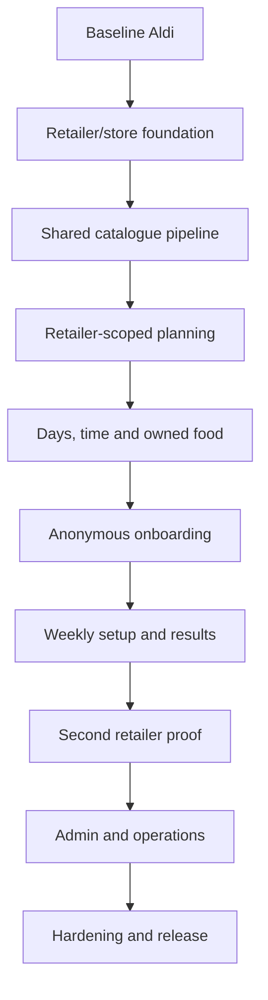

# ThriftChef Full Multi-Retailer Implementation Plan

**Status:** Approved for planning  
**Version:** 1.0  
**Repository:** `kofiarhin/thriftchef`  
**Target branch:** `docs/multi-retailer-product-spec`  
**Related specification:** `spec/thriftchef-multi-retailer-product-spec.md`  
**Last updated:** 2026-08-20

## 1. Objective

Evolve ThriftChef from an Aldi-specific seven-day generator into a free, anonymous, retailer-aware weekly cooking assistant without replacing the working deterministic planner.

A customer selects one supported supermarket, configures household and weekly constraints, and freely generates, regenerates, or swaps meals. Every recipe product, price and shopping-list item must come from the chosen retailer and resolved catalogue scope.

## 2. Delivery Principles

1. Keep Aldi operational after every production-capable slice.
2. Use test-first vertical slices rather than a single rewrite.
3. Establish retailer/store isolation before exposing supermarket selection.
4. Preserve deterministic planning, hard budget enforcement and bounded search.
5. Make database migrations additive and restartable.
6. Activate retailers only after catalogue and planner gates pass.
7. Keep generation open: no login, credits, subscription or paywall.
8. Separate operational abuse controls from product entitlements.
9. Do not present inferred allergens as verified safety information.
10. Add infrastructure only when measured load or recovery needs justify it.

## 3. Current-State Evidence

The current repository provides:

- React 19, Vite, TypeScript, Tailwind CSS and TanStack Query;
- Express 5, Mongoose and MongoDB;
- Crawlee with Playwright for Aldi catalogue collection;
- an Aldi-only `Product` retailer enum;
- compound retailer/store/product indexes;
- batched crawl upserts and price-change fields;
- allergen inference and planning eligibility;
- a deterministic bounded planner with recipe templates, beam search, validation and basket consolidation;
- variation-seed regeneration and single-meal replacement;
- backend unit/route/schema tests and Vitest client tests.

Current constraints that drive sequencing:

- `client/src/App.tsx` owns marketing, configuration, generation and results state.
- `server/models/Product.ts` restricts retailer identity to `aldi-uk`.
- `MealPlanRequest` has optional `storeId`, no required retailer and no selected cooking days.
- Planner construction assumes seven plan days.
- Aldi-specific crawling and shared normalization/persistence are coupled.

## 4. Implementation Sequence



## 5. Phase 0 — Baseline and Safety Net

### Slice 0.1: Capture Aldi compatibility

**Goal:** Prove that architectural migration preserves existing behaviour.

**Work:**

- Create representative Aldi catalogue fixtures.
- Capture fixed requests with fixed variation seeds.
- Record recipes, product IDs, basket totals, pack quantities, warnings and engine diagnostics.
- Add explicit assertions that every product matches `aldi-uk` and the configured store.
- Capture planner benchmark results.
- Record current catalogue status output.

**Likely files:**

- `server/testing/*`
- `server/mealPlanning/mealPlanEngine.test.ts`
- `server/mealPlanning/productSelector.test.ts`
- `server/mealPlanning/mealPlanRoutes.test.ts`
- `server/mealPlanning/plannerBenchmark.ts`

**Tests:**

- Same request, catalogue, engine version and seed return the same plan.
- All selected products are available and eligible.
- Basket consolidation matches known totals.
- Replacement preserves unaffected meals.

**Exit gate:**

- Current type checks, tests and build pass.
- Baseline fixtures and benchmark results are recorded.
- No runtime behaviour changes.

## 6. Phase 1 — Retailer and Store Domain

### Slice 1.1: Add retailer and store models

**Goal:** Model catalogue ownership without changing Aldi planning.

Create:

```text
server/models/
├── Retailer.ts
├── RetailStore.ts
└── CrawlRun.ts

server/catalogue/core/
├── retailerTypes.ts
├── catalogueTypes.ts
└── crawlTypes.ts
```

Retailer fields include slug, name, country, currency, adapter key, catalogue scope, lifecycle status and crawl policy.

Store fields include retailer ownership, stable external ID, name, postcode where relevant, scope and enabled state.

**Tests first:**

- Retailer slug is unique.
- External store identity is unique within a retailer.
- Store cannot resolve under another retailer.
- Only active retailers are selectable.
- National catalogue uses a logical national store.
- Lifecycle values reject unknown states.

**Migration:**

Seed or bootstrap:

- Aldi UK retailer;
- current Aldi store;
- current currency and freshness policy;
- adapter key `aldi`;
- lifecycle state `active`.

**Exit gate:**

Existing Aldi configuration resolves through retailer/store records with unchanged planner output.

### Slice 1.2: Add product offers

**Goal:** Separate descriptive product identity from store-specific price and availability.

Target ownership:

```text
Product
- retailerId
- retailerProductId
- name, brand, description
- categories and package metadata
- safety fields
- product URL and image

ProductOffer
- retailerId
- storeId
- productId
- current price
- comparison price
- promotion
- availability
- crawl provenance
```

**Indexes:**

- Product: unique `{ retailerId, retailerProductId }`.
- ProductOffer: unique `{ retailerId, storeId, productId }`.
- Planning query: `{ retailerId, storeId, available }` plus product eligibility.
- Freshness: `{ retailerId, storeId, lastCheckedAt }`.

**Additive migration:**

1. Create `ProductOffer`.
2. Backfill one offer per existing Aldi product.
3. Preserve legacy price/store fields temporarily.
4. Switch reads to offers behind a compatibility service.
5. Compare legacy and offer results.
6. Remove duplicated fields only in a later approved cleanup.

**Tests first:**

- Backfill is idempotent.
- Re-running it creates no duplicates.
- Different stores may price the same product differently.
- Offer cannot join to a product from another retailer.
- Legacy and offer basket totals match Phase 0 fixtures.

**Rollback:**

Switch compatibility reads back to existing product fields; no legacy data is dropped in this phase.

## 7. Phase 2 — Shared Catalogue Pipeline

### Slice 2.1: Define normalized contracts

Create:

```text
server/catalogue/contracts/
├── retailerAdapter.ts
├── normalizedCatalogueProduct.ts
└── retailerCategory.ts
```

Every adapter returns the same normalized product candidate. Missing source data is stored as `null`; it is never invented.

Contract fields include retailer product ID, name, brand, description, category paths, price, package data, raw safety data, image, canonical URL and availability.

### Slice 2.2: Extract the shared runner

Target structure:

```text
server/catalogue/
├── core/
│   ├── catalogueRunner.ts
│   ├── cataloguePersistence.ts
│   ├── catalogueNormalization.ts
│   ├── catalogueSafety.ts
│   ├── availabilityReconciliation.ts
│   └── crawlSummary.ts
├── adapters/
│   └── aldi/
│       ├── aldiAdapter.ts
│       ├── aldiCategories.ts
│       ├── aldiSelectors.ts
│       └── aldiAdapter.test.ts
├── contracts/
└── retailerRegistry.ts
```

**Shared runner owns:**

- Crawlee/Playwright lifecycle;
- request queue and deduplication;
- concurrency, rate limits, retries and timeouts;
- run identifiers and statuses;
- normalization and validation;
- allergen inference and safety assessment;
- batched MongoDB writes;
- price-change history;
- crawl summary and structured failures.

**Retailer adapter owns:**

- allowed retailer hosts;
- cookie and consent handling;
- postcode or store selection;
- categories;
- pagination and scrolling;
- listing selectors;
- detail selectors;
- stable product-ID extraction;
- retailer-specific promotion and availability interpretation.

**Common contract tests:**

- Stable non-name product identity.
- Canonical allowed-host URL.
- Integer non-negative price in pence.
- Valid category paths.
- Deterministic normalization.
- Safe missing-field handling.
- Retailer/store scope preserved.
- Fixture parsing detects selector drift.

**Exit gate:**

`npm run aldi:crawl` runs through the shared runner and produces output equivalent to the Phase 0 baseline.

### Slice 2.3: Trusted availability reconciliation

A missing product is marked unavailable only after a trusted full crawl.

Trust conditions:

- crawl mode is `full`;
- store selection was verified;
- all required categories completed;
- failures remain below configured thresholds;
- selector/layout failure is not suspected;
- crawl reaches a trusted completed state.

**Tests:**

- Trusted full crawl marks unseen offers unavailable.
- Bounded crawl never reconciles.
- Failed, cancelled or interrupted crawl never reconciles.
- Store-selection failure never reconciles.
- Reappearing product becomes available again.
- Reconciliation cannot affect another retailer or store.

## 8. Phase 3 — Retailer-Aware APIs

### Slice 3.1: Retailer discovery endpoints

Add:

```http
GET /api/retailers?countryCode=GB
GET /api/retailers/:retailerId/stores
GET /api/catalogue/status?retailerId=&storeId=
```

Public output includes retailer identity, logo, catalogue scope, selectable status and freshness. Internal adapter configuration is excluded.

**Tests:**

- Only active and sufficiently fresh retailers are selectable.
- Degraded/disabled states are represented correctly.
- Store lookup is always retailer-scoped.
- Unknown retailer/store returns a typed error.
- Aldi remains the only initial active customer option.

### Slice 3.2: Require retailer and store during generation

Extend `MealPlanRequest`:

```ts
interface MealPlanRequest {
  retailerId: string;
  storeId: string;
  // existing fields
}
```

Even a national catalogue resolves to a logical store ID so every plan has one explicit scope.

Update:

- `mealPlanTypes.ts`;
- `mealPlanSchemas.ts`;
- controller and service;
- `productSelector.ts`;
- replacement validation;
- catalogue status;
- client API types;
- fixtures and route tests.

Every catalogue query must require retailer, store, availability, eligibility and positive price.

Validate that must-have products belong to the resolved scope.

Add response provenance:

```ts
interface CatalogueProvenance {
  retailerId: string;
  retailerName: string;
  storeId: string;
  storeName: string;
  crawlRunId: string;
  catalogueUpdatedAt: string;
}
```

**Integrity tests:**

- Tesco product cannot enter Aldi plan.
- Product from another store cannot enter plan.
- Cross-scope must-have product is rejected.
- Meal replacement preserves catalogue scope.
- Response provenance matches every selected offer.

**Exit gate:**

Mixed-retailer and mixed-store plans are impossible through all public service paths.

## 9. Phase 4 — Planner Capabilities

### Slice 4.1: Selected cooking days

Add:

```ts
cookingDays: number[];
```

Use a documented day vocabulary such as ISO weekdays `1–7`.

Replace seven-day assumptions in:

- candidate construction;
- scoring;
- validator;
- response construction;
- meal replacement;
- shopping-list generation;
- frontend rendering.

**Tests first:**

- One selected day returns one planned day.
- Four selected days return exactly those four.
- Input order does not affect deterministic output.
- Duplicate/out-of-range days are rejected.
- Swap accepts only a planned day.
- Basket includes only selected meals.
- Seven selected days preserve legacy behaviour.

### Slice 4.2: Hard cooking-time limit

Add:

```ts
maxTotalMinutes?: number;
```

Filter recipe variants using `prepMinutes + cookMinutes`. Keep `quick` as a scoring preference, not a hard limit.

**Tests:**

- Thirty-minute request never returns a recipe over thirty minutes.
- Omitted limit preserves current behaviour.
- Replacement obeys the same limit.
- Invalid limits fail validation.
- Insufficient coverage returns a typed constraint-conflict error.

### Slice 4.3: Ingredients already owned

MVP support:

- generic pantry basics;
- explicitly selected catalogue products marked already owned.

Rules:

- owned products satisfy recipe demand;
- they remain visible in recipes;
- they are excluded from purchase totals;
- shopping list separates owned from required purchases;
- full pantry quantities and expiry remain out of scope.

**Exit gate:**

Generation, replacement, validation and shopping-list calculation support retailer, days, time and owned ingredients end to end.

## 10. Phase 5 — Anonymous Client Foundation

### Slice 5.1: Application routing and feature boundaries

Refactor the single-page state owner into:

```text
client/src/
├── app/
│   ├── AppRouter.tsx
│   └── queryClient.ts
├── features/
│   ├── onboarding/
│   ├── profile/
│   ├── retailers/
│   ├── weeklyPlan/
│   ├── recipes/
│   └── shopping/
├── pages/
│   ├── WelcomePage.tsx
│   ├── OnboardingPage.tsx
│   ├── HomePage.tsx
│   ├── WeeklySetupPage.tsx
│   ├── GeneratingPage.tsx
│   ├── PlanPage.tsx
│   ├── RecipePage.tsx
│   ├── ShoppingPage.tsx
│   └── ProfilePage.tsx
└── api/
```

Use TanStack Query for server state. Keep wizard/profile state local or in focused context; do not introduce Redux unless later evidence justifies global client-state complexity.

### Slice 5.2: Versioned local profile storage

Create a storage adapter with `load`, `save`, `clear` and version migration.

Handle:

- invalid JSON;
- unavailable storage;
- outdated versions;
- partial defaults;
- explicit data clearing.

Generate a random anonymous ID. Do not fingerprint the device.

**Exit gate:**

Existing Aldi generation continues through the new shell, and refreshing restores profile defaults without requiring an account.

## 11. Phase 6 — Customer Onboarding

### Slice 6.1: Welcome and retailer selection

Screens:

1. Welcome
2. Supermarket selection
3. Conditional store selection

Requirements:

- no sign-up, trial or payment language;
- only active catalogues are selectable;
- selected retailer controls all subsequent product search and generation;
- store screen appears only for store-scoped catalogues;
- saved retailer/store defaults restore on return;
- changing scope clears incompatible product selections.

### Slice 6.2: Household profile wizard

Screens:

1. Household size
2. Planning goals
3. Food and cuisine preferences
4. Allergies and dislikes
5. Kitchen equipment
6. Default cooking time
7. Profile summary

Every answer must affect planner input. Allergies are hard constraints; dislikes remain separately represented.

**Client tests:**

- keyboard-complete flow;
- back/forward preserves state;
- validation focuses the invalid control;
- saved profile restores;
- allergy warning is visible;
- no account/email is requested;
- logo-independent accessible retailer labels.

## 12. Phase 7 — Weekly Planning Flow

### Slice 7.1: Weekly setup wizard

Screens:

1. Cooking days
2. Meal type
3. Weekly budget
4. Cooking-time override
5. Available ingredients
6. Weekly mood
7. Review

Launch customer UI with dinner only, even if backend types retain additional meal types.

Weekly preferences supplement or override saved defaults but do not rewrite the household profile.

The review screen shows retailer/store, household, days, meal count, budget, time, preferences, allergies and owned ingredients with section edit actions.

**Tests:**

- at least one day required;
- GBP converts to integer pence;
- temporary overrides do not mutate defaults;
- product search is retailer/store scoped;
- review matches outgoing request exactly;
- generation has no entitlement check or paywall.

### Slice 7.2: Real generation and recovery states

Display stages:

- loading catalogue;
- applying constraints;
- building meals;
- checking budget;
- consolidating shopping list.

Do not show invented percentages.

Error mapping:

| Error | Recovery |
| --- | --- |
| Invalid request | Return to exact invalid section |
| Retailer unavailable/stale | Retry later or choose another retailer |
| Constraint conflict | Relax the named constraint |
| No affordable plan | Increase budget or reduce meals |
| Capacity exceeded | Retry |
| Network failure | Retry the same seed |
| Internal error | Preserve request and report failure |

## 13. Phase 8 — Generated Plan Experience

### Slice 8.1: Plan summary and weekly cards

Present:

- retailer/store;
- catalogue timestamp;
- estimated total;
- maximum budget;
- remaining amount;
- selected-day cards;
- recipe, swap, edit and regenerate actions.

Non-selected days show no cooking planned or are omitted according to the final UI design.

### Slice 8.2: Recipe page

Include:

- image and title;
- preparation, cooking and total time;
- servings and equipment;
- already-owned ingredients;
- retailer products to buy;
- pack quantities and price snapshots;
- numbered instructions;
- allergen warning;
- swap action.

Display saved plan snapshots, not live catalogue prices, when revisiting an existing plan.

### Slice 8.3: Meal replacement

Preferred interaction:

1. Request valid alternatives.
2. Show meal, time and full-basket price difference.
3. Confirm replacement.
4. Save revised plan.

Requirements:

- preserve unaffected meals;
- enforce the original retailer/store;
- revalidate budget, time, allergies and appliances;
- rebuild the complete shopping list;
- leave current plan unchanged on failure;
- prevent duplicate submission.

### Slice 8.4: Shopping companion

Include:

- retailer/store header;
- original estimated total;
- adjusted remaining estimate;
- aisle groups;
- product checkboxes;
- pack sizes, quantities and prices;
- already-owned state;
- progress;
- print/share output.

Persist checklist state locally by plan ID. Checking an item never rewrites historical pricing.

## 14. Phase 9 — Anonymous Plan Persistence

### Slice 9.1: Meal-plan model and retrieval

Store:

- anonymous ID;
- retailer/store/crawl provenance;
- request snapshot;
- engine version and seed;
- result and price snapshots;
- creation and expiry timestamps.

Routes:

```http
POST /api/meal-plans/generate
GET /api/meal-plans/:planId
POST /api/meal-plans/:planId/replace
```

Privacy:

- hash anonymous IDs in logs;
- configure TTL retention;
- provide local clear/reset controls;
- do not claim cross-device persistence;
- keep shareable URLs out of scope until explicitly decided.

**Tests:**

- saved plan survives later catalogue price changes;
- expired plan returns a typed response;
- IDs cannot be enumerated;
- replacement creates a consistent revised snapshot;
- retention cleanup does not affect catalogue data.

## 15. Phase 10 — Second Retailer Vertical Slice

### Slice 10.1: Discovery and go/no-go

Before implementation, determine:

- official or licensed feed availability;
- terms and robots restrictions;
- public catalogue accessibility;
- authentication requirements;
- postcode/store requirements;
- stable product identity;
- category and pagination design;
- safety information availability;
- rate constraints.

Choose the second retailer based on stable, permitted and attributable product data—not logo popularity.

### Slice 10.2: Bounded diagnostic adapter

Initial run:

- one catalogue/store;
- one category;
- five products;
- visible browser;
- JSON output;
- no database writes.

Add saved HTML/JSON fixtures and pass the common adapter contract suite.

### Slice 10.3: Full vertical activation

Implement:

1. category coverage;
2. product details;
3. normalization;
4. safety;
5. persistence;
6. full trusted crawl;
7. status endpoint;
8. retailer selection;
9. generation;
10. replacement;
11. shopping list.

Activation gates:

- minimum eligible-product coverage;
- recipe-role/category coverage;
- reliable price scope;
- successful trusted full crawl;
- planner benchmark;
- zero cross-retailer integrity failures;
- completed user-facing metadata and warnings.

## 16. Phase 11 — Admin and Operations

### Slice 11.1: Read-only admin UI

Screens:

- catalogue overview;
- retailers;
- stores;
- crawl runs;
- products;
- catalogue quality.

Show catalogue age, total/eligible products, price changes, missing safety data, category coverage, abrupt count changes and failed URLs.

Select an authentication mechanism before exposing admin routes outside a trusted environment.

### Slice 11.2: Scheduling and worker isolation

Start with one worker and retailer-specific schedules.

Prevent simultaneous full crawls for the same retailer/store.

Introduce a durable queue only when evidence shows:

- overlapping schedules;
- material loss on process restart;
- many independent retailer/store jobs;
- need for horizontal workers.

## 17. Phase 12 — Hardening

### Security

- Validate every public field, ID, list and numeric bound.
- Enforce retailer/store ownership at service and query boundaries.
- Disallow arbitrary crawler URLs.
- Restrict crawler hosts by adapter.
- Keep crawler controls private.
- Redact allergies, dislikes, recipes, product names and request bodies from logs.
- Apply body-size limits, timeouts and concurrency controls.
- Separate quiet abuse throttling from open-generation policy.
- Do not collect browser fingerprints.

### Accessibility

- Complete keyboard navigation.
- Visible focus.
- Correct headings and landmarks.
- Error summaries linked to fields.
- Accessible labels independent of logos and colour.
- Focus movement on page and wizard-step changes.
- Adequate mobile touch targets.
- Readable print shopping list.

### Performance

- Benchmark every active retailer fixture.
- Preserve planner hard timeout and bounded inputs.
- Measure API p50/p95.
- Verify planning and product-search indexes.
- Lazy-load product/meal images with stable dimensions.
- Return typed capacity failures instead of allowing unbounded work.

### Observability

Logs and metrics include correlation ID, retailer/store, adapter/engine versions, durations, counts and typed outcomes.

Never log customer constraints or complete meal/product content.

Alert on:

- repeated crawl failure;
- catalogue past freshness policy;
- abrupt product-count change;
- store-selection failure;
- suspected selector drift;
- planner latency/error regression;
- any cross-retailer contamination.

## 18. Rollout

1. Internal additive migration with Aldi only.
2. Aldi crawler compatibility verification.
3. Retailer-scoped planner verification.
4. New anonymous UI against Aldi.
5. Aldi public beta.
6. Second retailer internal validation.
7. Limited second-retailer activation.
8. Catalogue and plan-quality observation.
9. Add further retailers independently.

## 19. Rollback

For a retailer incident:

1. Set retailer to `degraded` or `disabled`.
2. Stop new generation for that scope.
3. Preserve saved plans.
4. Retain the last trusted catalogue.
5. Roll back adapter version or repair selectors.
6. Run a bounded diagnostic.
7. Run and validate a trusted full crawl.
8. Reactivate after all gates pass.

Database migrations remain additive until new reads and comparisons are verified. Legacy fields are not dropped in the release that introduces product offers.

## 20. Work Breakdown and Dependencies

| Epic | Dependency | Completion gate |
| --- | --- | --- |
| E0 Aldi baseline | None | Contracts and benchmark recorded |
| E1 Retailer/store models | E0 | Aldi resolves through registry |
| E2 Product offers | E1 | Legacy and offer totals match |
| E3 Shared crawler | E2 | Aldi crawl equivalent |
| E4 Reconciliation | E3 | Failure-safe tests pass |
| E5 Retailer APIs | E1 | Only active catalogues selectable |
| E6 Scoped planner | E2, E5 | Mixed scopes impossible |
| E7 Days/time/owned food | E6 | Constraints verified end to end |
| E8 Client foundation | E5 | Routing and local profile stable |
| E9 Onboarding | E8 | First-time setup complete |
| E10 Weekly setup | E7, E9 | Review emits valid request |
| E11 Results experience | E10 | Generate, swap and shop complete |
| E12 Plan persistence | E11 | Anonymous plans safely retained |
| E13 Second retailer | E3, E6 | Full vertical slice passes gates |
| E14 Admin/operations | E3, E13 | Quality and freshness observable |
| E15 Hardening/release | MVP epics | Release suite passes |

## 21. Verification per Slice

Every code-changing slice must run:

```bash
npm run typecheck
npm run test:unit
npm run test:client
npm run build
```

Also run `npm run benchmark:planner` whenever catalogue selection, planner input or search changes.

For crawler slices:

- run fixture tests;
- run a bounded no-write crawl;
- inspect normalized output;
- run a bounded persistence test;
- perform a full crawl only after diagnostic evidence is acceptable.

For UI slices:

- component tests;
- request-contract tests;
- keyboard/focus checks;
- mobile and desktop browser verification;
- network and typed-error recovery;
- console and failed-request inspection.

## 22. MVP Definition of Done

The redesigned MVP is complete when:

- Aldi uses the shared adapter pipeline.
- Retailer/store scope is required throughout backend flows.
- Users select cooking days and a hard cooking-time limit.
- Anonymous users complete onboarding without login, payment or email.
- Generate, regenerate and swap remain freely accessible.
- Plans contain products from exactly one retailer/store.
- Weekly plan, recipe and shopping list are mobile-first.
- Shopping-list prices and quantities match saved plan snapshots.
- Allergen warnings remain prominent and accurately qualified.
- Tests, type checks and production build pass.
- Planner benchmark shows no unacceptable regression.
- Failed crawls cannot corrupt availability.
- Operational status and freshness are visible per retailer.
- A second retailer is not activated until its full vertical slice passes.

## 23. Open Decisions

These do not block the Aldi foundation but must be resolved before their dependent phase:

1. Which retailer is the second integration proof?
2. What retention period applies to anonymous plans?
3. Should anonymous plan URLs become shareable?
4. What minimum product and category coverage activates a retailer?
5. Which authentication mechanism protects the admin UI?
6. Which retailers require physical branch selection?
7. What freshness threshold applies to each retailer?
8. What evidence triggers introduction of a durable crawl queue?
