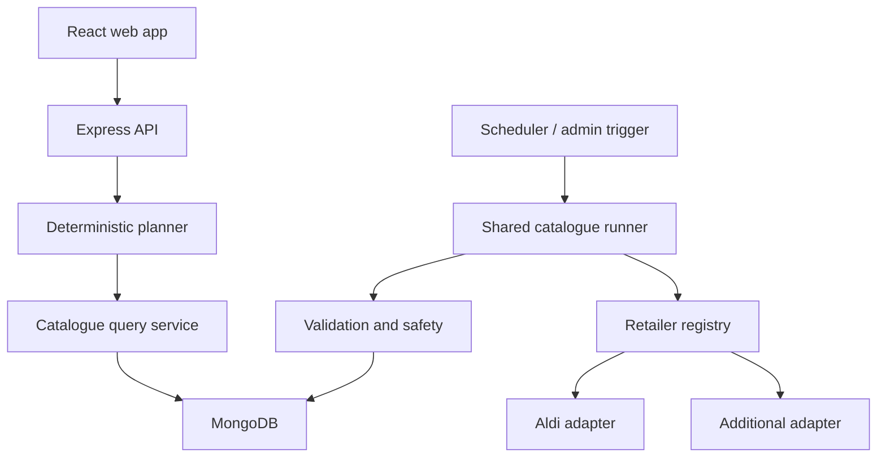
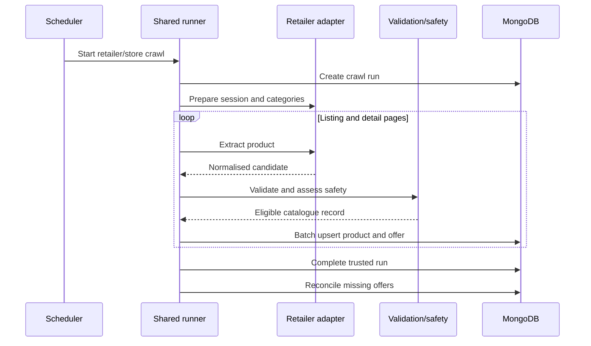

# ThriftChef Multi-Retailer Product and Implementation Specification

**Status:** Proposed  
**Version:** 1.0  
**Repository:** `kofiarhin/thriftchef`  
**Target:** Free anonymous multi-retailer MVP  
**Last updated:** 2026-08-20

## 1. Executive Summary

ThriftChef will evolve from an Aldi-specific seven-day meal-plan generator into a retailer-aware weekly cooking assistant. A user selects a supported UK supermarket, describes their household and weekly constraints, and freely generates, regenerates, or swaps meals. Every recipe, price, basket calculation, and shopping-list item must come exclusively from the selected retailer and resolved catalogue scope.

The existing deterministic planning engine remains the core. The change introduces:

- a reusable household profile stored locally without requiring an account;
- configurable cooking days, meal count, budget, time, preferences, appliances, allergies, dislikes, and owned ingredients;
- a shared catalogue pipeline with retailer-specific Crawlee adapters;
- retailer, store, product, offer, crawl-run, and price-history data ownership;
- catalogue provenance on every generated plan;
- mobile-first weekly plan, recipe, swap, and shopping-list screens;
- private catalogue administration and quality monitoring;
- an open generation policy with no customer-facing quota, login, subscription, trial, or paywall.

The system must start with Aldi working through the new adapter boundary, prove a second retailer end to end, and then add retailers without changing the planning engine or core database schema.

## 2. Context and Goals

### 2.1 Current-state facts

The current repository contains:

- React 19, Vite, TypeScript and Tailwind CSS on the client;
- Node.js, Express 5, Mongoose and MongoDB on the server;
- Crawlee with Playwright for the Aldi catalogue;
- an Aldi-specific category registry, selectors, store-selection flow and crawler entry point;
- batched product upserts, price-change fields, catalogue safety assessment and allergen inference;
- a deterministic, bounded meal-planning engine;
- catalogue filtering, recipe templates, beam search, validation, consolidated basket pricing, regeneration and single-meal replacement;
- Vitest client tests and Node/TypeScript backend tests.

### 2.2 Product goal

Allow a UK shopper to:

> Select a supported supermarket, enter household and weekly needs, and receive an affordable cooking plan and consolidated shopping list built only from that supermarket's current catalogue.

### 2.3 Success outcomes

1. A first-time anonymous user can generate a valid plan without authentication or payment.
2. A returning user can generate another week using saved defaults in approximately five interactions.
3. Products from different retailers or catalogue scopes can never be mixed in one plan.
4. Adding a retailer requires a new adapter, configuration, fixtures and activation record, not changes to planning logic or collection topology.
5. Catalogue quality and provenance remain visible enough to diagnose pricing, availability and safety failures.

## 3. Scope and Requirements

### 3.1 In scope

- UK and GBP for the first release.
- Dinner planning as the primary supported meal type.
- Anonymous use with local household-profile persistence.
- Retailer selection and conditional store selection.
- Selected cooking days rather than a mandatory seven-meal week.
- Explicit maximum cooking time.
- Weekly budget as a hard limit.
- Food preferences, cuisines, appliances, allergens, dislikes and owned ingredients.
- Plan generation, full regeneration and single-meal swapping.
- Consolidated retailer-specific shopping list.
- Retailer/store/product/offer/crawl-run database model.
- Shared crawler runner and retailer adapter contract.
- Admin catalogue, crawl and quality screens.
- Operational abuse protection that does not impose a visible normal-user quota.

### 3.2 Out of scope for this release

- Mandatory accounts or cross-device synchronisation.
- Subscriptions, credits, trials, paywalls or locked recipes.
- Production monetisation.
- Nutrition or medical claims.
- Guaranteed savings claims.
- Full pantry quantities and expiry management.
- Multiple retailers in one basket.
- Automated checkout or retailer basket submission.
- International markets, currencies or languages.
- Branch selection where the retailer exposes only a national catalogue.
- Production implementation or deployment under this specification.

### 3.3 Functional requirements

| ID | Requirement |
| --- | --- |
| FR-01 | The user can generate without registering or signing in. |
| FR-02 | The user must select one active retailer before generation. |
| FR-03 | Store selection is required only for store-scoped catalogues. |
| FR-04 | The client saves reusable profile defaults locally. |
| FR-05 | The user selects exact cooking days and receives meals only for those days. |
| FR-06 | The user sets a maximum weekly budget in GBP. |
| FR-07 | The planner applies household size, cooking time, appliances, preferences, allergens and dislikes. |
| FR-08 | Owned ingredients reduce the shopping list without changing recipe requirements. |
| FR-09 | The generated basket must not exceed the requested maximum budget. |
| FR-10 | A meal can be swapped while preserving unaffected days and repricing the complete basket. |
| FR-11 | Full regeneration uses a different variation seed while preserving the request. |
| FR-12 | Every plan records retailer, store/catalogue scope, crawl run and price snapshots. |
| FR-13 | Shopping-list items come exclusively from the selected catalogue. |
| FR-14 | An inactive, stale beyond policy or unavailable catalogue cannot be selected for new plans. |
| FR-15 | Admin users can inspect retailer status, crawl history, products and quality failures. |

### 3.4 Non-functional requirements

| ID | Requirement |
| --- | --- |
| NFR-01 | Planning remains deterministic for the same catalogue, request, engine version and variation seed. |
| NFR-02 | Planner search remains bounded by configured products, candidates, beam width, variants and timeout. |
| NFR-03 | Catalogue writes are idempotent by retailer, product identity and catalogue scope. |
| NFR-04 | An incomplete or untrusted crawl must never reconcile missing products as unavailable. |
| NFR-05 | Normal users can freely generate; abusive automation can be throttled privately. |
| NFR-06 | No request logs contain allergies, dislikes, recipes, product names or complete request bodies. |
| NFR-07 | Retailer adapter failure is isolated from other retailer catalogues. |
| NFR-08 | UI is mobile-first, keyboard accessible and exposes meaningful loading/error states. |
| NFR-09 | Customer routes never expose crawler execution controls. |
| NFR-10 | New retailer activation requires evidence of catalogue coverage, freshness and planning quality. |

## 4. Assumptions and Constraints

### Confirmed decisions

- MongoDB remains the catalogue and server-side persistence store.
- Crawlee with Playwright remains the browser-crawling framework.
- The deterministic meal-planning engine remains; no model is introduced into the request path.
- Users can generate, regenerate and swap freely.
- Retailers are extensible records rather than a fixed nine-value product constraint.
- The first migration preserves current Aldi behaviour.
- Only active integrations are selectable.

### Assumptions

- The first user-facing catalogue is retailer-level or one configured logical store per retailer.
- Server-side anonymous plan retention may be time-limited; the final retention period is an operational configuration.
- Retailer data acquisition is permitted for each enabled integration. Terms, robots policies and licensed-feed options must be reviewed before production activation.
- A durable distributed queue is unnecessary for the first two retailers; the scheduler interface must allow one later.

## 5. Proposed Architecture



### 5.1 Trust boundaries

- **Public browser:** untrusted input; holds only anonymous ID, CSRF-safe application state where applicable, and local profile defaults.
- **Public API:** validates every request and applies operational throttles.
- **Planning domain:** accepts only validated retailer/store/catalogue constraints.
- **Catalogue workers:** private processes allowed to browse retailer sites and write normalised catalogue records.
- **Admin surface:** authenticated and authorised separately; never reachable through customer capabilities.
- **Retailer websites:** external and untrusted; extracted content must be validated before persistence.

### 5.2 Sources of truth

| Data | Source of truth |
| --- | --- |
| Retailer activation and policy | `retailers` |
| Store/catalogue scope | `stores` |
| Product descriptive identity | `products` |
| Current price and availability | `productOffers` |
| Crawl outcome and freshness | `crawlRuns` |
| Existing recipe logic | Recipe templates and planner engine |
| Anonymous defaults | Browser local storage |
| Generated result | Immutable plan snapshots in `mealPlans` |
| Shopping progress | Browser state initially; server persistence later |

## 6. Components and Responsibilities

### 6.1 Client

- Onboarding and weekly setup state.
- Local household-profile persistence.
- Retailer and conditional store selection.
- Server-state access through TanStack Query.
- Plan, recipe, swap and shopping-list presentation.
- Recovery actions for typed API failures.
- No catalogue or meal-plan API logic directly inside presentation components.

### 6.2 Catalogue API/service

- List active retailers and stores.
- Resolve a requested catalogue scope.
- Reject stale, degraded or unavailable catalogues according to policy.
- Query only eligible, priced and available product offers.
- Attach catalogue provenance to planner input.

### 6.3 Shared catalogue runner

Owns:

- Crawlee/Playwright lifecycle;
- request queue, concurrency, retries and timeouts;
- run identifiers and status transitions;
- normalisation and schema validation;
- allergen inference and safety evaluation;
- batched MongoDB persistence;
- price-history changes;
- trusted availability reconciliation;
- metrics and structured failure reporting.

### 6.4 Retailer adapter

Owns only retailer-specific behaviour:

- session, cookie and consent preparation;
- postcode/store selection;
- category discovery or static registry;
- pagination or infinite scrolling;
- listing and detail selectors;
- stable product identity;
- price, pack-size, promotion and availability extraction;
- ingredients, allergen and dietary extraction;
- retailer-specific pacing limits.

```ts
export interface RetailerCatalogueAdapter<TCategory = RetailerCategory> {
  readonly adapterKey: string;

  prepareSession(context: AdapterContext): Promise<void>;
  discoverCategories(context: AdapterContext): Promise<TCategory[]>;

  extractListingPage(input: {
    context: AdapterContext;
    category: TCategory;
  }): Promise<{
    products: RetailerListingProduct[];
    nextPages: string[];
  }>;

  extractProduct(input: {
    context: AdapterContext;
    listing: RetailerListingProduct;
  }): Promise<NormalizedCatalogueProduct | null>;
}
```

### 6.5 Planning service

- Requires resolved `retailerId` and `storeId`.
- Selects only eligible offers from that scope.
- Generates meals only for requested days.
- Applies the explicit time constraint.
- Preserves existing deterministic bounds and variation seed.
- Validates plan integrity and basket price before returning.
- Reprices the entire basket after a meal swap.

### 6.6 Open generation policy

```ts
export interface GenerationPolicy {
  evaluate(context: GenerationContext): Promise<{
    allowed: boolean;
    reason?: string;
  }>;
}

export class OpenGenerationPolicy implements GenerationPolicy {
  async evaluate() {
    return { allowed: true };
  }
}
```

This boundary permits later entitlements without coupling monetisation to planning. Operational abuse controls remain separate.

## 7. Data Model

### 7.1 Retailer

```ts
interface Retailer {
  _id: ObjectId;
  slug: string;
  name: string;
  countryCode: "GB";
  currency: "GBP";
  adapterKey: string;
  catalogueScope: "national" | "regional" | "store";
  status: "development" | "validating" | "active" | "degraded" | "disabled";
  logoUrl?: string;
  crawlPolicy: {
    schedule?: string;
    maxConcurrency: number;
    requestsPerMinute: number;
    staleAfterHours: number;
  };
  createdAt: Date;
  updatedAt: Date;
}
```

Indexes: unique `{ slug: 1 }`; query `{ status: 1 }`.

### 7.2 Store

```ts
interface RetailStore {
  _id: ObjectId;
  retailerId: ObjectId;
  externalStoreId: string;
  name: string;
  postcode?: string;
  scope: "physical" | "online" | "regional" | "national";
  enabled: boolean;
  lastSuccessfulCrawlAt?: Date;
  createdAt: Date;
  updatedAt: Date;
}
```

Unique index: `{ retailerId: 1, externalStoreId: 1 }`.

### 7.3 Product

```ts
interface Product {
  _id: ObjectId;
  retailerId: ObjectId;
  retailerProductId: string;
  name: string;
  normalizedName: string;
  brand?: string;
  description?: string;
  categoryPaths: string[][];
  package: {
    raw?: string;
    quantity?: number;
    unit?: "g" | "kg" | "ml" | "l" | "each";
  };
  imageUrl?: string;
  productUrl: string;
  ingredientsRaw?: string;
  allergenAdviceRaw?: string;
  dietaryInformationRaw?: string;
  normalizedAllergens: string[];
  dietaryTags: string[];
  safetyStatus: "verified" | "inferred" | "insufficient";
  safetyIssues: string[];
  eligibleForPlanning: boolean;
  firstSeenAt: Date;
  lastSeenAt: Date;
  createdAt: Date;
  updatedAt: Date;
}
```

Unique index: `{ retailerId: 1, retailerProductId: 1 }`.

### 7.4 Product offer

```ts
interface ProductOffer {
  _id: ObjectId;
  retailerId: ObjectId;
  storeId: ObjectId;
  productId: ObjectId;
  priceMinor: number;
  currency: "GBP";
  comparisonPrice?: { priceMinor: number; unit: string };
  promotion?: {
    description: string;
    validFrom?: Date;
    validTo?: Date;
  };
  available: boolean;
  lastSeenAt: Date;
  lastCheckedAt: Date;
  lastCrawlRunId: ObjectId;
  createdAt: Date;
  updatedAt: Date;
}
```

Unique index: `{ retailerId: 1, storeId: 1, productId: 1 }`.

### 7.5 Price history

Store a row when price or promotion changes:

```ts
interface PriceHistory {
  retailerId: ObjectId;
  storeId: ObjectId;
  productId: ObjectId;
  priceMinor: number;
  promotionDescription?: string;
  observedAt: Date;
  crawlRunId: ObjectId;
}
```

### 7.6 Crawl run

```ts
interface CrawlRun {
  _id: ObjectId;
  retailerId: ObjectId;
  storeId?: ObjectId;
  adapterVersion: string;
  mode: "diagnostic" | "bounded" | "full";
  status:
    | "queued"
    | "running"
    | "completed"
    | "completed_with_warnings"
    | "failed"
    | "cancelled";
  startedAt?: Date;
  completedAt?: Date;
  categoriesRequested: number;
  categoriesCompleted: number;
  productsDiscovered: number;
  productsInserted: number;
  productsUpdated: number;
  priceChanges: number;
  failures: number;
  availabilityReconciled: boolean;
  errors: CrawlRunError[];
}
```

### 7.7 Anonymous household profile

Stored locally:

```ts
interface HouseholdProfile {
  version: 1;
  anonymousId: string;
  defaultRetailerId: string;
  defaultStoreId?: string;
  householdSize: number;
  defaultBudgetMinor?: number;
  defaultCookingDays: number[];
  maxTotalMinutes?: number;
  mealPreferences: string[];
  cuisinePreferences: string[];
  appliances: string[];
  allergies: string[];
  dislikedIngredients: string[];
  pantryBasics: string[];
  updatedAt: string;
}
```

No email, name or account is required.

### 7.8 Meal plan

```ts
interface MealPlan {
  _id: ObjectId;
  anonymousId: string;
  retailerId: ObjectId;
  storeId: ObjectId;
  crawlRunId: ObjectId;
  engineVersion: string;
  variationSeed: number;
  requestSnapshot: MealPlanRequest;
  estimatedTotalMinor: number;
  currency: "GBP";
  days: MealPlanDay[];
  shoppingList: ShoppingListGroup[];
  createdAt: Date;
  expiresAt?: Date;
}
```

Every ingredient/product reference stores name and price snapshots so later catalogue changes do not rewrite the historical result.

## 8. Data Flows

### 8.1 Catalogue ingestion



Availability reconciliation is permitted only for a full, trusted run with verified store selection, acceptable category completion and no layout-failure threshold breach.

### 8.2 Plan generation

1. Validate the public request.
2. Resolve an active retailer and catalogue store.
3. Verify freshness and catalogue availability.
4. Load priced, available, planning-eligible offers for that exact scope.
5. Exclude allergen conflicts and disliked ingredients.
6. Run bounded deterministic planning for selected cooking days.
7. Consolidate demand and round packages once across the week.
8. Reject over-budget candidates.
9. Store the request, result and catalogue provenance.
10. Return plan, retailer identity, catalogue timestamp and warnings.

### 8.3 Meal swap

1. Validate the submitted plan and target day.
2. Reload the same retailer/store scope.
3. Generate distinct alternatives satisfying the same constraints.
4. Replace one meal in a candidate copy.
5. Rebuild and reprice the full shopping list.
6. Reject alternatives that break budget or safety constraints.
7. Save and return the revised immutable plan.

## 9. Interfaces

### 9.1 Retailers

`GET /api/retailers?countryCode=GB`

Returns only public retailer metadata. A separate field identifies whether selection is currently allowed.

### 9.2 Stores

`GET /api/retailers/:retailerId/stores?postcode=`

Used only for store-scoped retailers. Postcode input is validated and rate-limited.

### 9.3 Generate plan

`POST /api/meal-plans/generate`

```ts
interface MealPlanRequest {
  anonymousId: string;
  retailerId: string;
  storeId?: string;
  budgetPence: number;
  householdSize: number;
  cookingDays: number[];
  mealTypes: ("dinner")[];
  maxTotalMinutes?: number;
  mealPreferences: string[];
  cuisinePreferences: string[];
  appliances: string[];
  allergies: string[];
  dislikedIngredients: string[];
  pantryBasics: string[];
  mustHaveProductIds: string[];
  variationSeed?: number;
}
```

Validation rules include:

- retailer active and compatible with store;
- budget positive and within configured public limits;
- household size within supported bounds;
- one to seven distinct cooking days;
- supported meal types only;
- must-have products belong to the resolved retailer/store;
- known vocabulary for appliances and allergy constraints;
- bounded list and string sizes.

### 9.4 Replace meal

`POST /api/meal-plans/:planId/replace`

Requires target day, expected plan version and variation seed. Use optimistic concurrency or an idempotency key to prevent double replacement.

### 9.5 Error contract

```json
{
  "error": {
    "code": "CATALOGUE_UNAVAILABLE",
    "message": "This supermarket catalogue is temporarily unavailable.",
    "details": {}
  }
}
```

Required codes include:

- `INVALID_MEAL_PLAN_REQUEST`
- `RETAILER_NOT_ACTIVE`
- `STORE_NOT_FOUND`
- `CATALOGUE_STALE`
- `CATALOGUE_UNAVAILABLE`
- `CATALOGUE_CONSTRAINT_CONFLICT`
- `NO_AFFORDABLE_PLAN`
- `NO_REPLACEMENT_AVAILABLE`
- `PLANNER_CAPACITY_EXCEEDED`
- `RATE_LIMITED`
- `PLANNER_INTERNAL_ERROR`

## 10. Customer UI Flow

### 10.1 First-time setup

| Screen | Required UI and behaviour |
| --- | --- |
| Welcome | Outcome-led headline, benefits and `Start planning`; no sign-up/trial copy. |
| Supermarket | Active retailer cards; chosen retailer controls all downstream catalogue data. |
| Store (conditional) | Postcode and resolved store list only when catalogue scope requires it. |
| Household | Large stepper and portion explanation. |
| Goals | Spend less, quick, simple, family, meal prep, protein, variety, low waste. |
| Food preferences | Protein/diet and cuisine selections; allow no preference. |
| Allergies | Hard exclusions, dislikes kept separate, prominent retailer-data warning. |
| Equipment | Hob, oven, microwave, air fryer, slow cooker, blender and grill. |
| Default time | Up to 30, 45, 60 or unrestricted. |
| Profile summary | Editable confirmation and `Plan my week`. |

### 10.2 Weekly setup

| Screen | Required UI and behaviour |
| --- | --- |
| Cooking days | Exact Monday-Sunday selection and generated meal count. |
| Meal types | Dinner only initially, structured for later expansion. |
| Budget | Large GBP input with household, meal count and retailer context. |
| Weekly time | Saved default with temporary override. |
| Available ingredients | Pantry basics and retailer-scoped product search; skippable. |
| Weekly mood | Temporary scoring preferences; does not rewrite saved profile. |
| Review | Full request summary with section edit links and `Generate my plan`. |
| Generating | Real stages without fake percentages; preserves inputs on failure. |

### 10.3 Results

| Screen | Required UI and behaviour |
| --- | --- |
| Plan summary | Retailer/store, basket estimate, budget, remainder, meal count and catalogue timestamp. |
| Weekly plan | Mobile day cards with meal, time, servings, cost, recipe and swap actions. |
| Swap meal | Alternatives with time, price difference and resulting basket total. |
| Recipe | Image, time, equipment, owned/buy ingredients, pack mapping, warning and steps. |
| Shopping list | One retailer, aisle groups, quantities, prices, checkboxes, owned state and progress. |
| Feedback | Optional meal and catalogue-quality feedback; never blocks generation. |

### 10.4 Returning user

The home dashboard shows the current/recent plan, selected retailer, household defaults, today's meal and shopping progress. The primary action is `Plan this week`. The short flow is cooking days, budget, available ingredients, review and generate.

### 10.5 Navigation

Mobile: Home, Week, Shopping, Profile.  
Desktop: My week, Shopping list, Profile, Plan this week.

### 10.6 UI state requirements

Every relevant screen must define:

- initial, loading, success, empty, stale, disabled and error states;
- focus management after navigation or validation;
- keyboard-operable controls and visible focus;
- accessible labels independent of retailer logos or colour;
- skeletons only for content whose shape is known;
- exact recovery action for typed server failures.

## 11. Admin UI

### 11.1 Catalogue dashboard

For each retailer/store show status, product count, eligible count, last successful crawl, freshness, crawl failures and activation state.

### 11.2 Crawl runs

Show queued/running/completed runs, mode, duration, categories, discoveries, inserts, updates, price changes, errors and whether availability reconciliation occurred.

### 11.3 Product catalogue

Filter by retailer, store, category, availability, safety, eligibility and staleness. Display current offer, product identity, raw safety data, price history, retailer URL, last seen and crawl provenance.

### 11.4 Retailer and store management

View retailer configuration, adapter version, scope, crawl policy, lifecycle state and registered stores. State-changing admin operations require explicit confirmation and audit logging.

## 12. Security and Privacy

- Treat all browser, retailer-page and extracted values as untrusted.
- Validate request fields, IDs, URLs, strings, arrays and numeric bounds.
- Enforce retailer/store ownership on every catalogue query.
- Prevent SSRF by disallowing arbitrary URLs in crawler job requests; adapters own allowed hosts.
- Keep crawl controls private and authorised.
- Redact secrets and user constraints from application logs.
- Log anonymous IDs only as non-reversible hashes where correlation is required.
- Apply body-size limits, timeouts, concurrency caps and abuse throttling.
- Keep generation visibly free; introduce CAPTCHA only when abuse evidence justifies it.
- Do not claim allergen safety. Preserve a prominent label-check warning.
- Do not store raw browser fingerprints.
- Define an anonymous plan retention period and TTL index before production.
- Provide a client control to clear local profile and plan references.

## 13. Reliability, Performance and Scaling

### 13.1 Planning

Preserve current bounded operation limits. Benchmark each retailer catalogue using representative eligible-product fixtures. Catalogue growth must not silently increase planner input above configured bounds.

### 13.2 Crawling

- Per-retailer concurrency and request-rate policy.
- Retry transient read failures only within bounded limits.
- Do not blindly retry state transitions or availability reconciliation.
- Batch product and offer writes.
- Make upserts idempotent.
- Isolate adapter failures.
- Use a single worker initially; add a durable queue and horizontally scaled workers only when concurrent schedules or recovery requirements justify them.

### 13.3 Degradation

- If one retailer is degraded, keep other active retailers available.
- Existing generated plans remain readable when a catalogue becomes stale.
- New generation fails with a typed recovery message when its catalogue is unsafe to use.
- A failed crawl leaves the last trusted catalogue intact.
- If plan persistence fails after generation, return a typed failure rather than an unaddressable plan.

## 14. Observability and Operations

### Logs

Use structured logs with:

- request/crawl correlation ID;
- retailer/store IDs;
- adapter and engine versions;
- stage, duration, counts and result code;
- no product names, meal contents, allergies, dislikes or full request bodies.

### Metrics

- crawl success/failure/cancellation by retailer;
- crawl duration and category completion;
- discovered, inserted, updated and unavailable counts;
- price-change count;
- eligible-product coverage;
- catalogue age;
- plan latency p50/p95/max;
- generation success by error code;
- candidate counts and budget rejection rates;
- swap success rate;
- cross-retailer integrity violations, expected to remain zero.

### Alerts

Alert on:

- repeated crawl failure;
- catalogue beyond freshness policy;
- abrupt product-count or eligible-count change;
- store-selection failure;
- selector/layout failure threshold;
- planner error-rate or latency regression;
- any detected cross-retailer product contamination.

### Health

Separate liveness from readiness. API readiness should include database connectivity, while retailer catalogue availability remains retailer-specific and must not make the complete API unhealthy.

## 15. Alternatives and Trade-offs

| Decision | Recommended | Rejected alternative | Reason |
| --- | --- | --- | --- |
| Catalogue storage | Shared collections with retailer/store keys | Database per retailer | Easier global operations and no schema multiplication. |
| Product pricing | Product identity plus store-scoped offer | Duplicate full product per store | Avoids descriptive duplication and supports local pricing. |
| Crawler design | Shared runner plus adapters | Copy Aldi crawler nine times | Prevents duplicated retries, persistence, safety and observability. |
| User access | Anonymous and open | Mandatory account/trial | Reduces first-plan friction while user value is unproven. |
| Planner | Existing deterministic bounded engine | LLM-generated request path | Retains repeatability, cost control and catalogue integrity. |
| Scaling | Single worker, queue-ready interface | Distributed queue immediately | Meets current scale with lower operational burden. |
| Retailer vocabulary | Database records and adapter registry | Fixed nine-retailer union | New retailers do not require central schema migration. |

## 16. Risks and Mitigations

| Risk | Mitigation |
| --- | --- |
| Retailer terms or site changes block crawling | Review each source before activation; prefer official/licensed feeds; isolate adapter. |
| Store-specific prices are attributed incorrectly | Require verified scope, store ownership and crawl provenance. |
| Incomplete crawl marks products unavailable | Reconcile only after a trusted full run and threshold checks. |
| Missing allergen data creates false confidence | Exclude conflicts conservatively, mark inferred/insufficient, keep prominent warning. |
| Catalogue size slows planning | Apply balanced selection caps and retailer benchmarks. |
| Free endpoint attracts automation | Quiet throttles, concurrency control, idempotency and evidence-driven CAPTCHA. |
| Anonymous history is lost | Explain device-local defaults; persist shareable plans with TTL; accounts later. |
| Adapter count increases maintenance | Contract tests, fixtures, shared runner, lifecycle status and activation gates. |
| Products leak between retailers | Compound keys, required scope filters, must-have validation and integrity tests. |

## 17. Delivery and Migration Plan

### Phase 0: Baseline evidence

- Record current Aldi crawl and planner behaviour.
- Preserve representative fixtures and benchmark results.
- Add integration assertions that current plans contain only Aldi/store products.

### Phase 1: Shared catalogue foundation

- Introduce retailer and store records.
- Split product identity from store-scoped offer where migration evidence supports it.
- Extract shared normalisation, safety, batching, price tracking and summaries.
- Wrap Aldi behind the adapter contract without changing output.
- Add trusted availability reconciliation.

Exit criterion: Aldi crawl and plan behaviour remain equivalent through the new boundary.

### Phase 2: Retailer-aware planning

- Require retailer/store in catalogue queries and plan requests.
- Add provenance snapshots.
- Add selected cooking days and explicit time limits.
- Validate must-have product scope.
- Update generate and replace contracts.

Exit criterion: automated tests prove no mixed-retailer or mixed-store plan is possible.

### Phase 3: Anonymous product experience

- Build first-time setup, weekly setup, review and real generation states.
- Save profile locally.
- Redesign weekly plan, recipe, swap and shopping list.
- Add retailer/store visibility throughout results.
- Keep open generation policy active.

Exit criterion: a new user completes a plan without authentication and a returning user re-plans using saved defaults.

### Phase 4: Second-retailer vertical slice

- Perform accessibility and terms discovery.
- Build bounded no-write diagnostic adapter.
- Add fixtures and shared contract tests.
- Enable persistence for one store/catalogue.
- Benchmark planning quality.
- Activate the retailer only after passing catalogue gates.

Exit criterion: selection through crawl, MongoDB, generation, swap and shopping list works for both Aldi and the second retailer.

### Phase 5: Operational scale

- Add catalogue/admin screens, freshness alerts and quality metrics.
- Schedule isolated retailer jobs.
- Introduce a durable queue only when measured concurrency or recovery needs require it.
- Add further retailers independently.

### Future phase

Accounts, cross-device plans, full pantry, reminders and monetisation. Introducing entitlements replaces the generation policy; it must not rewrite the planning engine.

## 18. Verification and Acceptance Criteria

### Customer journey

- An anonymous first-time user can generate a dinner plan without login, payment or email.
- The chosen retailer is visible on selection, review, plan summary and shopping list.
- A returning user with local defaults reaches generation in no more than five primary interactions.
- Regeneration and meal swap are available without visible quota.
- Invalid and unavailable states preserve user inputs and offer a specific recovery action.

### Catalogue integrity

- Every plan product and offer has the requested retailer and store.
- Every must-have product from another scope is rejected.
- Every plan records crawl run and catalogue timestamp.
- A failed/bounded crawl never performs availability reconciliation.
- A newly added adapter passes the common fixture contract suite.

### Planner

- Selected days exactly match returned planned days.
- Every recipe respects supported appliance and maximum-time constraints.
- Final consolidated basket is at or below the maximum budget.
- Swap preserves unaffected meals and revalidates the complete basket.
- Same inputs, catalogue, engine version and seed produce the same result.

### Safety

- Conflicting inferred allergens are excluded before planning.
- Insufficient/ambiguous products are ineligible.
- Allergy-aware plans display the label-check warning.
- Logs contain no request bodies, allergies, dislikes, recipe contents or product names.

### Performance and operations

Targets must be benchmarked on the intended environment before release. At minimum:

- planner remains within its configured hard timeout;
- API reports typed capacity failure instead of unbounded work;
- crawl status and catalogue freshness are visible per retailer;
- one degraded retailer does not prevent planning from another active retailer;
- unexpected catalogue count changes generate an operational signal.

### Test strategy

- Unit tests for normalisation, validation, safety and policy.
- Fixture-based shared adapter contract tests.
- MongoDB integration tests for indexes, idempotent upserts and reconciliation.
- Planner tests for scope isolation, selected days, time and budget.
- API contract tests for typed success/failure responses.
- Vitest/Testing Library tests for onboarding, review, recovery, regeneration and swap.
- End-to-end vertical tests for each active retailer using isolated fixtures.
- Accessibility checks for keyboard navigation, labels, focus and contrast.

## 19. Open Questions

These decisions do not block the Aldi-first architectural work but must be resolved before their affected phase:

1. Which retailer will be the second integration proof?
2. What exact freshness threshold applies to each retailer?
3. What anonymous plan retention period and deletion policy will be used?
4. Which retailers require physical branch selection versus a logical national store?
5. What minimum eligible-product and category-coverage thresholds permit activation?
6. Should plan URLs be shareable during the anonymous MVP?
7. Which operational identity provider protects the admin interface?

## 20. Definition of Done

This specification is implemented when:

- Aldi runs through the shared retailer adapter pipeline with preserved behaviour;
- at least one additional retailer completes the same crawl-to-plan vertical slice;
- customer generation remains anonymous and free;
- selected cooking days and time constraints affect actual planner output;
- retailer/store scope is enforced in storage, APIs, plans, swaps and shopping lists;
- required customer and admin screens expose defined loading, error and recovery states;
- availability reconciliation, safety warnings and provenance rules are verified;
- acceptance tests and retailer benchmarks pass with recorded evidence;
- rollout and rollback procedures are documented for every activated retailer.
