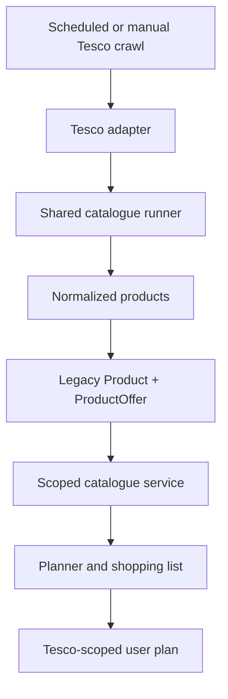

# ThriftChef Tesco Store Integration — Full Product and Implementation Specification

| Field | Value |
|---|---|
| Status | Approved implementation specification; implementation not started |
| Version | 1.0 |
| Repository | `kofiarhin/thriftchef` |
| Baseline | `main` at `3eeaef07e408cf5bb44a9f87a4f077cbea348c7d` |
| Updated | 2026-08-22 |
| Intended branch | `docs/tesco-store-integration-spec` |

## 1. Executive summary

ThriftChef will add Tesco UK as its second retailer by implementing a Tesco adapter behind the existing retailer adapter contract and shared catalogue runner. A user will choose Aldi or Tesco, choose an applicable store or fulfilment scope, and receive a meal plan, replacement meals, prices, and shopping list sourced only from that selection.

Tesco must be integrated as a configured, pre-crawled catalogue scope. A plan request must never trigger a Tesco crawl. The crawler runs separately, populates store-scoped catalogue data, and records crawl provenance. Tesco remains non-selectable while its retailer record is in `development` or `validating`; it may become `active` only after catalogue freshness, scope verification, price reconciliation, isolation tests, and authorization gates pass.

The implementation reuses the shared runner for browser lifecycle, queueing, normalization, safety assessment, persistence, coverage, price history, crawl runs, and reconciliation. The Tesco adapter owns only Tesco-specific navigation, consent, location/session selection, category discovery, selectors, pagination, and product extraction. It must not write to MongoDB or reproduce runner behavior.

This document specifies the complete implementation. It does not authorize a production crawl, production database mutation, activation, merge, or deployment.

## 2. Goals and success criteria

### 2.1 Goals

1. Add `tesco-uk` and at least one configured Tesco catalogue scope.
2. Extract stable Tesco products using numeric Tesco product IDs, never names.
3. Verify the configured store or fulfilment location before any store-scoped persistent write.
4. Persist Tesco data through the existing normalized product and offer path.
5. Generate and regenerate Tesco-only plans and shopping lists within budget.
6. Preserve strict retailer and store isolation across all planner operations.
7. Keep Tesco hidden or disabled until the catalogue is populated, fresh, validated, and authorized.
8. Provide fixture-driven tests, bounded diagnostics, observability, activation gates, and rollback instructions.

### 2.2 Product success criteria

- Aldi and Tesco appear in the retailer flow only according to retailer status.
- Selecting Tesco requires the applicable Tesco scope when more than one scope exists.
- Every product referenced by a Tesco plan has the requested Tesco retailer ID and store ID.
- Regenerating a week or replacing a meal preserves the original retailer/store scope.
- The shopping-list total equals the sum of the selected basket prices in integer minor units.
- A generated basket respects the requested weekly budget under existing planner semantics.
- A stale, unverified, empty, or non-active Tesco scope cannot be presented as ready.

### 2.3 Engineering success criteria

- Tesco fixture and adapter contract tests pass.
- A five-product, visible-browser, no-write diagnostic succeeds.
- A bounded crawl against a verified non-production database succeeds without reconciliation.
- A trusted full crawl records coverage, price history, and safe reconciliation behavior.
- The full typecheck, unit tests, client tests, build, browser verification, and planner benchmark pass.
- The production read path remains `CATALOGUE_READ_SOURCE=legacy` until offer equivalence is independently proven.

## 3. Non-goals

- Crawling Tesco in response to a user plan request.
- Supporting every Tesco store in the MVP.
- Signing in to a personal Tesco account or reusing personal cookies.
- Using Clubcard or conditional promotional prices for budget calculations.
- Replicating Tesco checkout, basket submission, delivery-slot booking, or purchasing.
- Replacing the shared catalogue runner or creating Tesco-specific persistence.
- Switching production globally from legacy products to `ProductOffer` reads as part of this work.
- Activating Tesco in production before authorization and validation gates pass.

## 4. Verified baseline and gaps

The baseline already contains retailer/store models, scoped catalogue queries, a retailer adapter interface and registry, normalized catalogue products, product offers, price history, crawl runs, coverage, trusted reconciliation, retailer-aware onboarding, persisted plans and shopping lists, and cross-scope planner tests. Aldi is the only registered adapter.

The following implementation gaps must be addressed:

| Area | Baseline | Required change |
|---|---|---|
| Adapter registry | Aldi only | Register full and bounded Tesco adapters |
| Tesco extraction | Absent | Add Tesco session, listing, pagination, detail, and parsing code |
| Store persistence guard | Store verification affects reconciliation trust | Block all store-scoped persistent product writes unless verification succeeds |
| Availability persistence | Persistence currently forces `available: true` | Persist `NormalizedCatalogueProduct.available` in legacy and offer records |
| Seeds | Aldi only | Seed Tesco retailer and at least one testing scope idempotently |
| Commands | Aldi crawl/diagnostic only | Add Tesco diagnostic and crawl scripts |
| Fixtures/tests | Aldi only | Add Tesco fixtures, selector tests, adapter tests, and shared-runner hardening tests |
| Production eligibility | Tesco absent | Add validation and activation evidence without activating in this change |

## 5. Binding design decisions

1. **Catalogue model:** Tesco is a configured, pre-crawled scope. The first scope may represent a physical store, collection location, or online fulfilment catalogue, but its model and UI label must accurately describe what was verified.
2. **Product identity:** `retailerProductId` is the numeric ID from `/shop/en-GB/products/<id>`. A listing tile ID and URL ID must agree when both exist.
3. **Price source:** normal shelf price is authoritative for MVP budgeting. Clubcard, multibuy, coupon, and other conditional prices are ignored as basket prices.
4. **Store verification:** persistent store-scoped crawling fails closed. No product batch may be written before the configured scope is verified in the active browser session.
5. **Availability:** availability is meaningful only after scope verification and must be carried through normalization and persistence.
6. **Missing data:** missing optional values remain `null`. Missing stable ID, name, standard price, or permitted canonical URL rejects the product.
7. **Activation:** Tesco starts in `development`, advances to `validating` during evidence gathering, and becomes selectable only in `active`.
8. **Read source:** production stays on `legacy` until a separate offer backfill comparison proves equivalence.
9. **Authorization:** crawler authorization is a production gate. Technical readiness does not imply permission to reproduce or republish Tesco data.

## 6. User experience

### 6.1 Onboarding and selection

The existing retailer picker remains the entry point. Active retailers are selectable; non-active retailers are absent or visibly unavailable according to the existing UI contract. Selecting Tesco loads its active stores/scopes. Changing retailer clears any previously selected store. Changing Tesco scope invalidates any in-progress plan state tied to the old scope.

The selected IDs are stored using the existing profile fields:

- `defaultRetailerId`
- `defaultStoreId`

Labels must distinguish physical stores from logical online scopes. Do not display an online fulfilment catalogue as a named physical branch unless that branch was explicitly selected and verified.

### 6.2 Planning and replacement

All plan, regenerate-week, replace-meal, recipe, and shopping-list calls must carry or derive the same retailer/store scope. Server-side scope resolution is authoritative; client state is not trusted to supply catalogue products directly.

Saved plan provenance must continue to identify retailer, store, and crawl run. A replacement operation must query within the saved plan's scope, not the user's latest default if the default has changed since the plan was created.

### 6.3 Failure states

- No active Tesco scope: Tesco is not selectable.
- Active scope but no fresh catalogue: return the existing catalogue-unavailable/stale behavior and do not fall back to Aldi.
- Insufficient products for preferences or budget: report the scoped planning failure; never expand to another retailer or store.
- Crawl/session verification failure: record a failed crawl run and retain the last trusted catalogue without reconciling it unavailable.

## 7. Target architecture



The Tesco adapter implements `RetailerAdapter` from `server/catalogue/contracts/retailerAdapter.ts`. The shared runner remains the sole owner of queueing, retries, concurrency, normalization, allergen assessment, batched persistence, crawl-run status, price history, coverage, and reconciliation.

The implementation must add:

```text
server/catalogue/adapters/tesco/
├── tescoAdapter.ts
├── tescoSelectors.ts
├── tescoCategories.ts
├── runTescoCrawl.ts
├── tescoAdapter.test.ts
└── tescoSelectors.test.ts

server/testing/fixtures/tesco/
├── listing.html
├── listing-drifted.html
├── product-detail.html
└── product-detail-labelled.html
```

Supporting changes are expected in:

```text
server/catalogue/adapters/registry.ts
server/catalogue/core/catalogueRunner.ts
server/catalogue/core/cataloguePersistence.ts
scripts/bootstrap-retailers.ts
package.json
.env.example
README.md
```

## 8. Tesco scope and browser session

### 8.1 Scope configuration

Each Tesco `RetailStore` record must have a stable `externalStoreId` representing the verified Tesco location or logical catalogue scope. Store records must state the correct existing scope kind (`physical`, `online`, `regional`, or `national`) and include a user-facing name that matches the evidence.

Configuration required for a store-scoped crawl:

- external store/scope ID;
- postcode used to establish fulfilment location, when required;
- fulfilment mode (`delivery` or `collection`), when required;
- expected location text or other stable verification evidence;
- optional start URL override for diagnostics only, restricted to the allowed host.

### 8.2 Session preparation

`TescoAdapter.prepareSession` must:

1. start from a fresh Playwright browser context controlled by the runner;
2. navigate only to an exact allowed Tesco host;
3. handle the consent dialog with semantic selectors and tolerate its absence;
4. open the location/fulfilment control;
5. enter the configured postcode or select the configured fulfilment scope;
6. select the configured result deterministically;
7. wait for the page/session state to settle;
8. avoid login and avoid importing external cookies or local storage;
9. emit redacted, structured status logs without postcode or session-token leakage.

Consent handling must not depend on generated CSS class names. It should prefer accessible roles, labels, stable `data-testid` values, and bounded text alternatives kept in `tescoSelectors.ts`.

### 8.3 Verification

`TescoAdapter.verifyStoreSelection` returns true only when the active page/session exposes evidence matching the configured scope. Acceptable evidence, in priority order, is:

1. a stable scope/store identifier in Tesco session or page state that exactly matches `externalStoreId`;
2. an explicit selected location label matching `expectedStoreText` after normalization;
3. a tested combination of fulfilment mode and postcode-area label that uniquely identifies the configured logical scope.

The adapter must not infer verification from successful product rendering alone. Logs must include the evidence type and a hash or redacted value, not sensitive session data.

For a store-scoped persistent run, the runner must complete verification before enqueuing writable product work or before committing any staged batch. Verification false, indeterminate, or exceptional must fail the run with zero product writes. A no-write diagnostic may continue to extraction so selectors can be evaluated, but it must clearly report `storeVerified: false` and cannot be treated as catalogue evidence.

## 9. Categories and traversal

`tescoCategories.ts` defines a curated allowlist of food categories needed by the meal planner. It must not scrape a department tree indiscriminately.

Initial groups should cover:

- fresh fruit and vegetables;
- meat and poultry;
- fish and seafood;
- dairy, eggs, and dairy alternatives;
- bakery and bread;
- rice, pasta, noodles, grains, and pulses;
- tins, jars, cooking ingredients, herbs, and spices;
- frozen food relevant to meals;
- breakfast cereals and meal-relevant pantry staples;
- vegetarian and vegan proteins.

Exclude alcohol, tobacco, household goods, clothing, electronics, pharmacy, pet care, and non-meal seasonal merchandise. Drinks and confectionery should be excluded from MVP unless planner role coverage demonstrates a specific requirement.

Each entry contains a stable internal key, Tesco browse URL, expected breadcrumb/title, enabled flag, and optional role tags. Category URLs must remain beneath `/shop/en-GB/browse/` on the allowed host.

### 9.1 Pagination and lazy loading

The listing extractor must support Tesco's current paged/lazy-rendered catalogues without assuming one rendering strategy forever:

- parse explicit next-page links when present;
- preserve valid `page` and supported page-size/count parameters;
- if products are lazy-rendered, scroll in bounded increments until the visible product count stabilizes;
- stop when the displayed range reaches the displayed total, the next link is absent/disabled, or a configured diagnostic bound is reached;
- de-duplicate pages and products by normalized URL and numeric product ID;
- reject discovered links outside the allowed host/path;
- cap pages and products per category to prevent loops.

A page claiming a non-zero result count but yielding zero valid product tiles is selector drift and must fail loudly. A sudden material extraction-rate drop should be recorded as a drift error rather than interpreted as mass unavailability.

## 10. Selector and extraction contract

### 10.1 Selector policy

Selectors must prefer, in order:

1. stable semantic attributes such as `data-testid` and documented structured metadata;
2. accessible roles and labels;
3. stable element relationships within a product tile or labelled section;
4. narrowly scoped text alternatives.

Generated/minified CSS classes are prohibited as primary selectors. All alternatives live in `tescoSelectors.ts`, are fixture-tested, and return explicit parse results or typed errors.

Observed discovery evidence includes listing elements shaped like `li[data-testid="301219119"]`, `data-auto-available="true"`, product URLs shaped like `/shop/en-GB/products/296057883`, standard and unit prices, and pages displaying a visible item range/total. These are discovery inputs, not immutable guarantees; fixtures must capture the actual HTML used for implementation.

### 10.2 Listing product extraction

Each valid tile should produce:

- `retailerProductId` from numeric tile ID and/or product URL;
- product name;
- absolute canonical product URL;
- normal shelf price in integer pence;
- raw pack-size text where present;
- raw unit/comparison price where present;
- image URL where present;
- availability evidence;
- raw promotion text for diagnostics only, without replacing the normal price;
- source category key.

ID extraction uses a path-anchored numeric rule equivalent to:

```ts
/\/products\/(\d+)(?:\/)?$/
```

Query parameters and fragments are removed before matching. If tile `data-testid` is numeric and the URL also contains an ID, they must be equal. A disagreement rejects the tile and raises a structured identity error.

### 10.3 Detail extraction

The detail extractor enriches the listing record with:

- canonical name and URL;
- current normal shelf price and pack size;
- ingredients;
- allergy information;
- dietary information;
- availability;
- primary image;
- product description where present.

The detail ID must match the listing ID. A mismatch is never repaired by changing identity.

Ingredients, allergy, and dietary content must be bounded by their labelled heading/section. Parsing stops at the next peer heading; text from preparation, storage, manufacturer, reviews, or marketing must not bleed into food-safety fields. Both container-based and labelled-sibling layouts are fixture-tested.

### 10.4 Allowed hosts and URLs

The initial exact navigation allowlist is:

```ts
["www.tesco.com"]
```

Canonical product URLs must use HTTPS, host `www.tesco.com`, and path `/shop/en-GB/products/<numeric-id>`. Credentials, nonstandard ports, arbitrary redirects, fragments, and unsupported paths are rejected.

Product images may be served by a separately validated Tesco content host such as `digitalcontent.api.tesco.com`. An image host is not automatically added to the crawler's navigation allowlist. Image URLs are stored as data only and validated by a dedicated image-host rule.

## 11. Normalization and missing-data rules

Tesco records must pass the existing `NormalizedCatalogueProduct` contract:

- stable numeric retailer product ID;
- non-empty normalized name;
- standard price as non-negative integer minor units;
- canonical allowed URL;
- `null` for absent optional fields;
- explicit boolean availability based on verified evidence;
- raw source values retained only in fields intended for them.

Price parsing must handle whole-pound and decimal GBP values using string parsing, not binary floating-point multiplication. Examples:

| Input | Result |
|---|---:|
| `£1` | `100` |
| `£1.30` | `130` |
| `£0.75` | `75` |
| missing/blank | reject product |

Do not derive pack size from the name when a reliable dedicated value is absent. Do not invent ingredients, allergens, dietary claims, categories, comparison prices, or availability.

## 12. Standard, Clubcard, and promotional prices

The normal shelf price is the only MVP basket price. When both a normal price and a Clubcard/promotional price are present:

- `price`/standard offer price receives the normal shelf price;
- the conditional price is ignored for planner totals;
- diagnostic metadata may record that a promotion was observed;
- `ProductOffer.promotion` remains `null` until its conditions, eligibility, type, and expiry can be represented reliably;
- raw unit price is stored in the existing comparison/raw field where supported.

If only a conditional price appears and no unambiguous normal shelf price can be extracted, reject the product rather than understate the user's cost. A future promotion phase requires a separate spec and must never silently change budget semantics.

## 13. Availability and reconciliation

Availability is extracted from stable tile/detail evidence such as an explicit availability attribute and enabled Add state. It is valid only after the configured scope is verified.

`cataloguePersistence.ts` must stop hardcoding `available: true`. Both legacy `Product` and `ProductOffer` writes must use the normalized availability value. Tests must prove unavailable Tesco products remain unavailable through both write paths.

Reconciliation rules remain shared:

- diagnostics never reconcile;
- bounded crawls never reconcile;
- failed or unverified runs never reconcile;
- a full run reconciles only when store verification succeeded, category completion and failure thresholds pass, at least one product was found, and the run is otherwise trusted;
- selector drift or access challenges make the run untrusted;
- mass absence is not applied when category coverage materially drops.

The last trusted catalogue must remain usable according to existing freshness rules after a failed crawl. `lastSuccessfulCrawlAt` is updated only by a successful, trusted persistent run.

## 14. Database seeds and configuration

### 14.1 Retailer seed

`scripts/bootstrap-retailers.ts` must idempotently upsert:

```text
name: Tesco UK
slug: tesco-uk
adapterKey: tesco
countryCode: GB
currencyCode: GBP
catalogueScope: store
status: development
```

Use the actual field names and enum values from `Retailer.ts`. Do not set `active` in the implementation PR.

### 14.2 Store/scope seed

Seed at least one Tesco scope with:

- unique slug and stable `externalStoreId`;
- retailer reference;
- accurate display name;
- correct scope kind;
- configured postcode/region only where the model permits non-secret location metadata;
- non-active/testing readiness through its parent retailer status;
- no fabricated crawl freshness timestamp.

The exact first location must be chosen from a manually verified Tesco session. If Tesco exposes only an online fulfilment catalogue for the chosen postcode, seed an `online` scope rather than claiming a physical store.

### 14.3 Environment variables

Add documented, non-secret examples as applicable:

```dotenv
TESCO_STORE_ID=
TESCO_POSTCODE=
TESCO_EXPECTED_LOCATION_TEXT=
TESCO_FULFILMENT_MODE=delivery
TESCO_HEADLESS=false
TESCO_MAX_PRODUCTS_PER_CATEGORY=
```

The run script should normally resolve scope configuration from the seeded store and use environment variables only for operational overrides/diagnostics. Validate configuration at startup with actionable errors. Never log a full postcode, cookie, token, MongoDB URI, or secret.

Before any persistent command, print a redacted database identity and require the existing safe environment policy. Local `.env` remains untracked. No bootstrap, migration, reconciliation, or crawler command may run until the target is confirmed non-production unless separate production approval exists.

## 15. Adapter registry and commands

Register:

- `tesco`: full Tesco adapter;
- a bounded/diagnostic Tesco adapter or equivalent runner configuration that imposes product/category limits without changing extraction semantics.

Add package scripts consistent with the Aldi commands:

```json
{
  "tesco:crawl": "...runTescoCrawl...",
  "tesco:diagnostic": "...runTescoCrawl... --diagnostic"
}
```

`tesco:diagnostic` must default to:

- one curated category;
- at most five valid products;
- visible browser;
- no database writes;
- no availability reconciliation;
- structured summary of store verification, pages, tiles, valid products, rejected products, and reasons.

The full crawl command must require an explicit store/scope and refuse ambiguous defaults.

## 16. Shared runner changes

The shared runner needs two correctness changes before Tesco persistent crawling:

1. **Persistence precondition:** for any store-scoped persistent run, store verification must succeed before the first batch write. Prefer verifying the prepared session before writable requests are queued. If architecture requires later verification, stage extracted products until verification succeeds; do not write and then attempt rollback.
2. **Availability fidelity:** pass normalized availability to both legacy and offer persistence rather than forcing true.

Retain existing responsibilities and avoid Tesco branches in core logic. Any new runner behavior must be expressed as generic scope/trust policy and covered with a fake adapter.

The current adapter context naming can be clarified so the value passed from `RetailStore.externalStoreId` is not mistaken for a URL slug. A rename is optional if it would create broad churn, but comments and tests must make the semantics explicit.

## 17. Test-driven implementation

### 17.1 Fixtures

Capture and sanitize one real Tesco listing page and one product detail page manually after establishing the intended scope. Remove session tokens, analytics IDs, personal data, and unrelated script payloads while retaining the DOM needed by tests. Create controlled variants:

- `listing.html`: representative tiles, IDs, price types, availability, next-page evidence;
- `listing-drifted.html`: non-zero catalogue indication with primary selectors absent or structurally changed;
- `product-detail.html`: container-labelled ingredients/allergy/dietary fields;
- `product-detail-labelled.html`: sibling-heading boundary layout and missing optional fields.

Fixtures are source evidence and must include a short comment or adjacent test note recording capture date, route, scope type, and sanitization.

### 17.2 Required unit and adapter tests

- numeric product ID extraction from absolute and relative URLs;
- tile ID/URL ID agreement and mismatch rejection;
- integer GBP parsing including whole-pound values;
- canonical URL generation and query/fragment removal;
- exact allowed-host/path validation and hostile URL rejection;
- listing-card extraction;
- pagination discovery and bounded lazy-scroll completion;
- duplicate product de-duplication;
- missing standard price rejection;
- optional missing fields stay `null`;
- ingredients/allergen/dietary section boundary parsing;
- normal shelf price wins over Clubcard/promotional price;
- conditional-price-only product rejection;
- verified store/session success, mismatch, missing evidence, and exception;
- selector drift fails loudly;
- no generated CSS class is required by primary fixture paths.

### 17.3 Shared runner and persistence tests

- store-scoped persistent run with failed verification performs zero product writes;
- no-write diagnostic may extract but never persists or reconciles;
- bounded persistent crawl never reconciles;
- full untrusted crawl never reconciles;
- trusted full crawl may reconcile under existing thresholds;
- normalized `available: false` persists to legacy product and product offer;
- failed Tesco crawl does not mark the last catalogue unavailable;
- crawl run records adapter version, scope, verification status, counts, and failure reason.

### 17.4 Planner and API tests

- Tesco products cannot enter Aldi plans;
- Aldi products cannot enter Tesco plans;
- Tesco Store A products cannot enter Store B plans;
- regeneration preserves retailer and store;
- meal replacement preserves retailer and store;
- saved plan and recipe routes preserve provenance;
- a Tesco basket remains within budget under standard shelf prices;
- shopping-list total equals the generated basket total;
- an unavailable Tesco product is not selected;
- no scoped inventory produces an explicit failure rather than cross-retailer fallback.

### 17.5 Client tests

- retailer selection renders Tesco only in the correct status;
- selecting Tesco loads its scopes;
- changing retailer clears the previous store;
- selected retailer/store persist through the existing profile flow;
- stale or unavailable Tesco state is communicated;
- Tesco plan, regenerate, replacement, recipe, and shopping-list calls retain scope.

## 18. Implementation sequence and acceptance slices

### Slice 0 — Safety baseline

- Create a non-main feature branch.
- Verify the database target before any data command.
- Record baseline test results without changing production configuration.
- Confirm `.env` is untracked and secrets are absent from output.

**Acceptance:** clean, reviewable branch and documented baseline; no database writes.

### Slice 1 — Pure selectors and fixtures

- Add sanitized fixtures.
- Write failing selector/price/ID/section tests.
- Implement pure parsing helpers without browser or database dependencies.

**Acceptance:** all fixture tests pass, including drift and missing-data cases.

### Slice 2 — Session and scope verification

- Implement consent, postcode/fulfilment selection, and verification.
- Add fake-page and bounded real-browser tests where safe.
- Add structured/redacted session diagnostics.

**Acceptance:** correct scope verifies; mismatch and indeterminate evidence fail closed.

### Slice 3 — Listing and detail adapter

- Implement curated categories, pagination/lazy loading, listing extraction, and detail enrichment.
- Register adapter only for tests/diagnostics.

**Acceptance:** contract tests pass and all normalized samples are manually reviewed.

### Slice 4 — Runner and persistence hardening

- Gate store-scoped persistence on verification.
- persist actual availability.
- test bounded/no-write reconciliation behavior.

**Acceptance:** zero writes on failed verification; availability round-trips correctly.

### Slice 5 — Registry, seed, configuration, and scripts

- Register Tesco adapters.
- add idempotent development retailer/scope seed;
- document variables and add commands.

**Acceptance:** repeated bootstrap is idempotent in non-production and Tesco remains non-active.

### Slice 6 — Real-data diagnostic and bounded crawl

- Run one category/five products visibly with no writes.
- Then, after review, run a bounded crawl against a non-production database with reconciliation disabled.
- Inspect normalized and persisted products manually.

**Acceptance:** store evidence, IDs, normal prices, pack sizes, availability, ingredients/allergens, canonical URLs, and counts are credible.

### Slice 7 — Planner isolation and totals

- Populate sufficient non-production Tesco role coverage.
- Run Tesco-only planner, replacement, regeneration, and shopping-list tests.

**Acceptance:** no cross-scope product appears; budgets and totals reconcile exactly.

### Slice 8 — Browser flow

- Verify retailer/store onboarding and Tesco plan lifecycle on desktop and mobile viewports.
- Run existing browser verification commands.

**Acceptance:** scope is retained through the full user journey and failure states are clear.

### Slice 9 — Validation and activation proposal

- Perform an authorized full crawl into the intended environment.
- collect freshness, coverage, plan quality, price, and isolation evidence;
- move retailer only to `validating` during review;
- request separate approval for `active`, merge, production crawl, or deployment.

**Acceptance:** a reviewer can decide activation from recorded evidence. No automatic activation occurs.

## 19. Diagnostics and observability

Each Tesco crawl run should expose structured fields already supported by crawl-run records plus adapter-specific evidence where modelled:

- retailer ID, store ID, external scope ID (non-sensitive);
- adapter version;
- mode (`diagnostic`, `bounded`, `full`);
- `persist` and `reconcile` flags;
- store verification result and evidence type;
- category/page discovered, completed, and failed counts;
- tiles seen, valid products, rejected products, and rejection reasons;
- duplicate IDs and ID mismatches;
- standard-price/conditional-price observations;
- available/unavailable counts;
- selector-drift/access-challenge flags;
- duration, retry count, and final trust decision.

Use stable error codes such as `TESCO_SCOPE_UNVERIFIED`, `TESCO_SELECTOR_DRIFT`, `TESCO_PRODUCT_ID_MISMATCH`, `TESCO_STANDARD_PRICE_MISSING`, `TESCO_HOST_REJECTED`, and `TESCO_ACCESS_CHALLENGE`. Avoid product-page HTML, cookies, postcodes, tokens, and connection strings in logs.

Alert/review thresholds should include zero products, a material fall from recent coverage, category failure above the shared trust threshold, verification failure, standard-price parse spikes, and unexpected host/path discovery.

## 20. Security, privacy, and operational safety

- Restrict navigation to exact approved HTTPS hosts and paths; validate redirects before following.
- Never accept arbitrary crawl URLs from public API input.
- Use fresh automation sessions; do not use personal Tesco accounts or cookies.
- Redact postcodes and session identifiers from logs and fixtures.
- Bound pages, scroll cycles, retries, concurrency, and category/product counts.
- Preserve existing allergen safety assessment; do not infer missing allergy data.
- Keep secrets in environment/configuration services and `.env` untracked.
- Treat access blocks as crawl failures, not obstacles to bypass.
- Review current Tesco terms and obtain the required permission/licensed source before production crawling or catalogue republication. `robots.txt`, sitemaps, and public pages are not authorization.
- Never run local tooling against production MongoDB without explicit production approval and a verified target.

## 21. Verification commands

Run targeted Tesco tests first, then the complete project verification:

```bash
npm run typecheck
npm run test:unit
npm run test:client
npm run build
npm run benchmark:planner
npm run tesco:diagnostic
npm run catalogue:verify
npm run verify:browser
```

Also run any current adapter/browser/catalogue commands discovered in `package.json` at implementation time. Diagnostics must use no-write mode. Any command that persists data requires a separately verified non-production database during development.

The implementation PR must include:

- exact commit tested;
- command results;
- diagnostic configuration and redacted output;
- five manually reviewed normalized product examples;
- bounded crawl counts and rejected-product reasons;
- isolation, budget, and total evidence;
- mobile and desktop browser evidence;
- explicit statement of database environment and whether reconciliation ran.

## 22. Activation gates

Tesco may move from `development` to `validating` when fixture/contract tests and the no-write diagnostic pass. It may move to `active` only when every gate below is satisfied:

1. Legal/operational authorization for the data source is recorded.
2. The intended production scope is explicitly identified and store/session verification is reliable.
3. An authorized full crawl completes with trusted status.
4. Catalogue freshness meets the existing application threshold.
5. Category and meal-role coverage are sufficient for representative plans.
6. Normal shelf prices and shopping totals are manually reconciled.
7. Ingredients/allergen boundaries are manually reviewed for samples.
8. Aldi/Tesco and store/store isolation suites pass.
9. Regeneration and replacement retain scope.
10. Mobile and desktop user flows pass.
11. Monitoring, failure behavior, and rollback are ready.
12. Separate approval is given for activation and deployment.

`CATALOGUE_READ_SOURCE=legacy` remains unchanged during activation. Switching to offers requires a separate backfill/equivalence decision covering counts, IDs, price, availability, and planner results.

## 23. Rollout and rollback

### 23.1 Rollout

1. Merge approved implementation while Tesco remains `development`.
2. Deploy code without exposing Tesco.
3. Run authorized catalogue population and validation.
4. Move to `validating` while collecting evidence.
5. After explicit approval, change Tesco to `active`.
6. Observe selection, planning failures, catalogue freshness, and crawl health.

### 23.2 Rollback

The primary rollback is changing Tesco status to `disabled` or `degraded` according to existing semantics, which removes/prevents selection without deleting catalogue history. Stop scheduled Tesco crawls, preserve crawl-run evidence, and leave Aldi unaffected. Do not delete offers, products, or price history as the first response.

If bad data was written, identify it by retailer, store, and crawl run. Any cleanup must be a separately reviewed, narrowly scoped operation with a backup/recovery plan. Never broaden cleanup to Aldi or unrelated stores.

## 24. Risks and mitigations

| Risk | Impact | Mitigation |
|---|---|---|
| Tesco authorization unresolved | Production crawler cannot be enabled | Keep retailer non-active; prefer approved/licensed feed; record permission gate |
| Store/session semantics misunderstood | Wrong prices or availability | Accurate scope modelling; explicit verification; fail before writes |
| Selector drift | Empty or corrupt catalogue | Semantic selectors, fixtures, extraction-rate checks, fail-loud drift errors |
| Clubcard price mistaken for shelf price | Unrealistically low budgets | Parse standard price explicitly; reject conditional-only records |
| Availability forced true | Out-of-stock products enter plans | Persist normalized availability through both storage paths |
| Failed crawl triggers mass reconciliation | Trusted catalogue disappears | Existing trust gates plus no reconciliation on bounded/unverified/drifted runs |
| Cross-retailer/store leakage | Invalid plans and totals | Server-side scope resolution and end-to-end isolation tests |
| Production database targeted locally | Material data damage | Redacted target verification and explicit approval before persistent commands |
| Offer/legacy divergence | Different production behavior | Retain legacy read source until separate equivalence proof |

## 25. File-level implementation inventory

| File | Change |
|---|---|
| `server/catalogue/adapters/tesco/tescoSelectors.ts` | Pure selectors, URL/ID/price/section helpers, typed parse failures |
| `server/catalogue/adapters/tesco/tescoCategories.ts` | Curated Tesco food-category registry and traversal metadata |
| `server/catalogue/adapters/tesco/tescoAdapter.ts` | `RetailerAdapter` implementation for session, verification, listing, and detail extraction |
| `server/catalogue/adapters/tesco/runTescoCrawl.ts` | Validated operational entry point for diagnostic/bounded/full modes |
| `server/catalogue/adapters/tesco/*.test.ts` | Fixture, contract, pricing, verification, pagination, and drift tests |
| `server/testing/fixtures/tesco/*` | Sanitized listing/detail evidence and controlled variants |
| `server/catalogue/adapters/registry.ts` | Tesco full/bounded registration |
| `server/catalogue/core/catalogueRunner.ts` | Generic fail-before-write verification rule |
| `server/catalogue/core/cataloguePersistence.ts` | Persist normalized availability |
| `scripts/bootstrap-retailers.ts` | Idempotent Tesco development retailer and initial scope |
| `package.json` | `tesco:crawl` and `tesco:diagnostic` scripts |
| `.env.example` | Document safe Tesco configuration variables |
| `README.md` | Development, diagnostic, safety, and activation guidance |
| planner/API/client tests | Tesco/Aldi/store isolation, totals, selection, regeneration, replacement |

## 26. Definition of done

Tesco integration is complete when:

- adapter fixtures and contract tests pass;
- store verification gates all store-scoped writes;
- a bounded real-data crawl succeeds against non-production;
- Tesco retailer/store records exist with accurate scope semantics;
- catalogue products, offers, availability, and provenance are correctly scoped;
- Tesco-only plans, replacements, regeneration, recipes, and shopping lists work;
- basket budgets and shopping-list totals reconcile using standard shelf prices;
- no cross-retailer or cross-store contamination occurs;
- the complete test/build/benchmark/browser suite passes;
- mobile and desktop verification passes;
- a draft implementation PR contains the required evidence;
- authorization is resolved before production crawling/republication;
- production activation, merge, crawl, database mutation, and deployment occur only with their required approvals.

## 27. Implementation handoff checklist

- [ ] Re-inspect current `main` and repository instructions before implementation.
- [ ] Create a non-main implementation branch.
- [ ] Verify the database target and clean working tree.
- [ ] Capture and sanitize scoped Tesco listing/detail fixtures.
- [ ] Write failing pure parser and adapter tests.
- [ ] Implement Tesco selectors and categories.
- [ ] Implement consent/location preparation and fail-closed verification.
- [ ] Implement listing, pagination/lazy loading, and detail extraction.
- [ ] Harden shared persistence verification and availability fidelity.
- [ ] Register Tesco and add testing seeds/configuration/scripts.
- [ ] Run the five-product, visible, no-write diagnostic.
- [ ] Review diagnostic products manually.
- [ ] Run a bounded non-production crawl without reconciliation.
- [ ] Verify products/offers/price history/availability and scope.
- [ ] Run planner, isolation, budget, and shopping-total tests.
- [ ] Run mobile and desktop browser verification.
- [ ] Run the full command suite.
- [ ] Open a draft implementation PR with redacted evidence.
- [ ] Obtain separate authorization and production activation approval.

## 28. Evidence status at specification publication

| Item | Status |
|---|---|
| Multi-retailer foundation | Implemented in baseline |
| Tesco listing shape and numeric product IDs | Discovery evidence observed; fixture capture still required |
| Tesco product/detail extraction | Specified, not implemented |
| Tesco store/session verification | Specified, not implemented |
| Tesco database seeds | Specified, not implemented |
| Bounded crawl | Not run |
| Production authorization | Unresolved gate |
| Tesco activation | Not approved |
| Production crawl/database change/deployment | Not authorized |

This status table prevents the specification from being mistaken for implementation or verification evidence.
